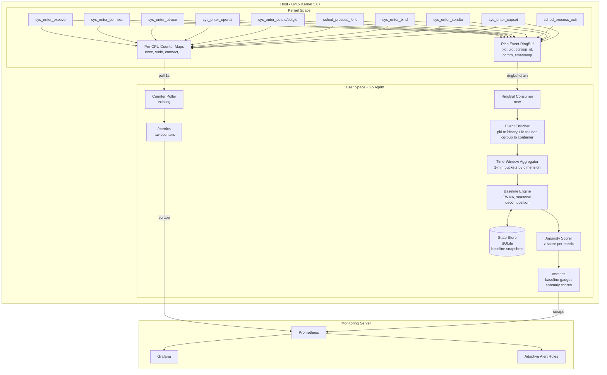
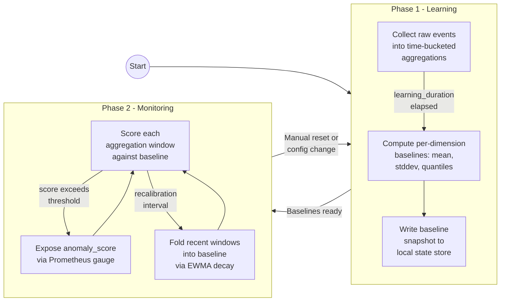
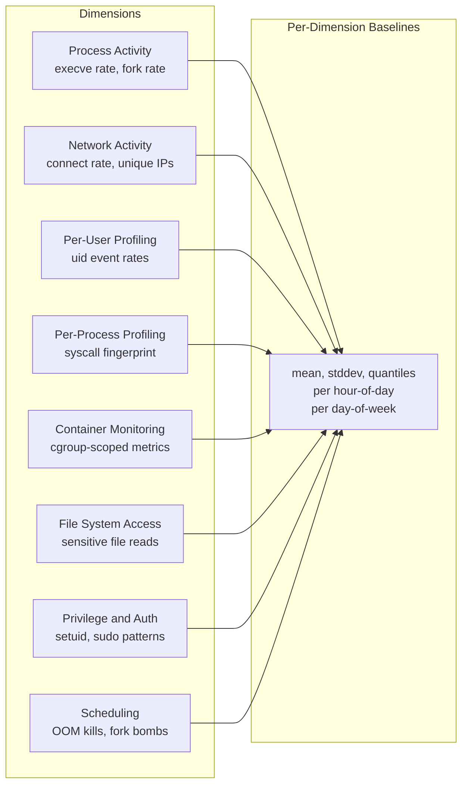
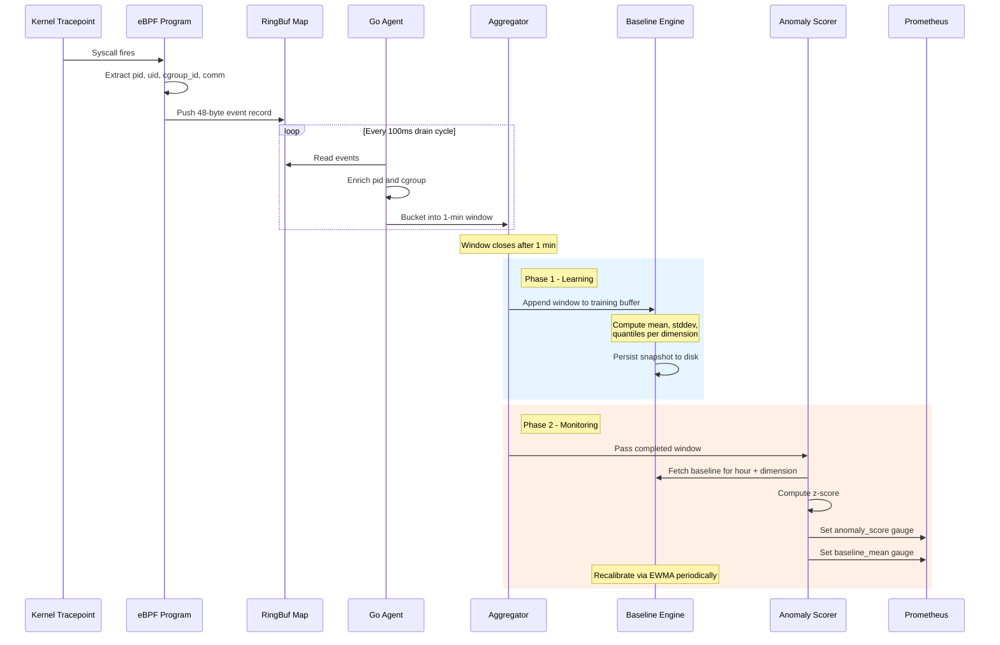
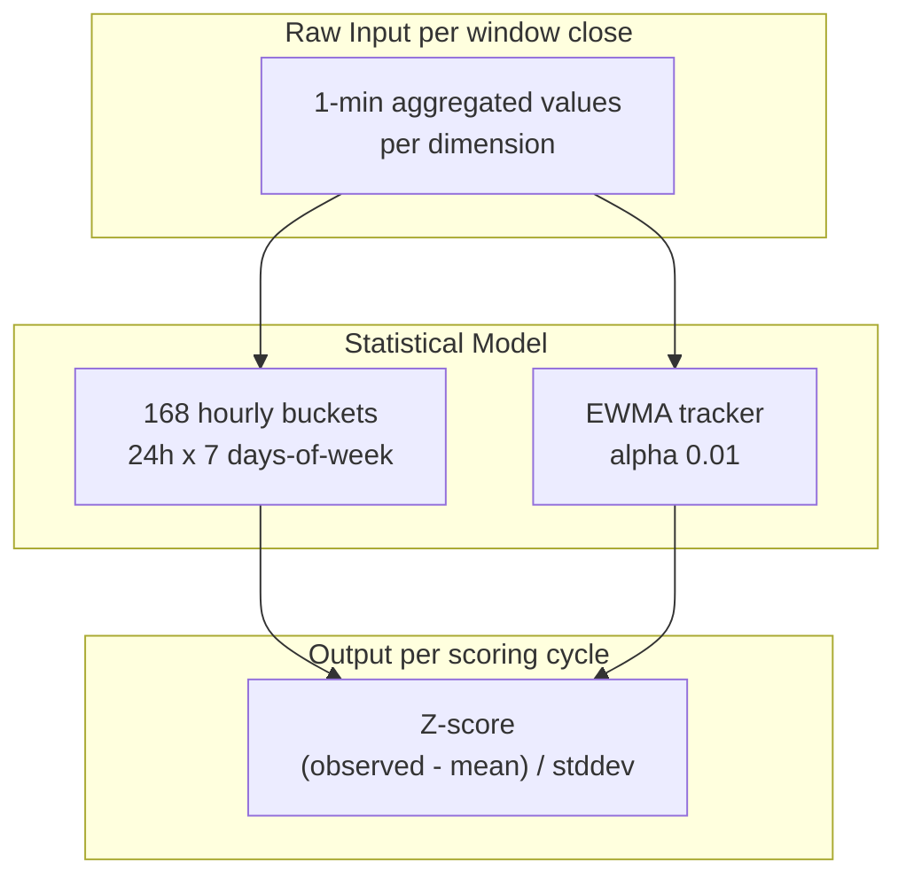

# Adaptive Baseline eBPF Monitoring System

## Overview

This document describes the architecture of the two-phase, host-adapting monitoring system
implemented in the eBPF agent. The agent automatically learns what "normal" looks like for
each host and detects deviations from that learned baseline.

---

## High-Level Architecture



---

## Two-Phase Lifecycle



### Phase 1 — Learning (Baseline Establishment)

The agent collects events for a configurable duration (default: 7 days) to capture
weekday/weekend and day/night variance. During this phase:

- All events are aggregated into **1-minute buckets** per dimension (user, process, container, metric type).
- At the end of the learning period, the engine computes per-dimension statistics:
  - **Mean** and **standard deviation** (overall and per hour-of-day / day-of-week).
  - **Exponentially Weighted Moving Average (EWMA)** for trend tracking.
- The baseline snapshot is persisted to disk so the agent survives restarts without re-learning.

### Phase 2 — Monitoring (Anomaly Detection)

Each aggregation window (default: 1 minute) is scored against the stored baseline:

- **Z-score**: `(observed - mean) / stddev` per dimension, per hour-of-day bucket.
- Scores above a configurable threshold (default: 3.0) are flagged as anomalies.
- The baseline itself slowly adapts via EWMA decay (`α = 0.01`) so seasonal drift
  does not cause permanent false positives.
- A **recalibration interval** (default: 24h) folds the last day's data into
  the running baseline.

---

## Monitoring Dimensions

The adaptive system breaks monitoring into **eight orthogonal dimensions**, each producing
its own baseline profile.

### Dimension Map



### Detailed Metric Catalog

Metrics marked with **(planned)** are not yet implemented and represent future expansion targets.

| Dimension | Metric | Source (tracepoint / kprobe) | Baseline Granularity | Status |
|---|---|---|---|---|
| **Process** | `exec_rate` | `sys_enter_execve` | per-host, per-user, per-hour | Implemented |
| **Process** | `fork_rate` | `sched_process_fork` | per-host, per-hour | Implemented |
| **Process** | `short_lived_process_count` | `sched_process_exit` (lifetime < 1s) | per-host, per-hour | Partial (exit events captured, lifetime filtering planned) |
| **Network** | `connect_rate` | `sys_enter_connect` | per-host, per-user, per-hour | Implemented |
| **Network** | `unique_dest_ips` | `sys_enter_connect` (IPv4 dedup) | per-host, per-hour | Planned |
| **Network** | `listening_port_count` | `sys_enter_bind` | per-host, per-container | Implemented |
| **Network** | `dns_query_rate` | `sys_enter_sendto` (port 53 filter) | per-host, per-hour | Implemented |
| **Network** | `bytes_tx` / `bytes_rx` | `cgroup/skb` or `sock_sendmsg` | per-container, per-hour | Planned |
| **Per-User** | `uid_exec_rate` | `sys_enter_execve` + `bpf_get_current_uid_gid` | per-uid, per-hour | Implemented |
| **Per-User** | `uid_priv_escalation_rate` | `sys_enter_setuid` | per-uid | Implemented |
| **Per-User** | `uid_sensitive_file_rate` | `sys_enter_openat` | per-uid | Implemented |
| **Per-Process** | `comm_syscall_profile` | all traced syscalls + `bpf_get_current_comm` | per-comm, per-day | Implemented |
| **Per-Process** | `comm_child_spawn_rate` | `sched_process_fork` | per-comm | Implemented |
| **Container** | `cgroup_exec_rate` | `sys_enter_execve` + `bpf_get_current_cgroup_id` | per-cgroup, per-hour | Implemented |
| **Container** | `cgroup_connect_rate` | `sys_enter_connect` + cgroup | per-cgroup, per-hour | Implemented |
| **Container** | `cgroup_fork_rate` | `sched_process_fork` + cgroup | per-cgroup, per-hour | Implemented |
| **File System** | `sensitive_file_access_rate` | `sys_enter_openat` (path filter) | per-host, per-hour | Implemented |
| **File System** | `tmp_file_creation_rate` | `sys_enter_openat` (O_CREAT + `/tmp`) | per-host, per-hour | Planned |
| **File System** | `file_write_rate` | `sys_enter_write` (sampled) | per-host, per-hour | Planned |
| **Privilege** | `sudo_rate` | `sys_enter_execve` (path match) | per-host, per-hour | Implemented |
| **Privilege** | `setuid_rate` | `sys_enter_setuid` | per-host | Implemented |
| **Privilege** | `capability_change_rate` | `sys_enter_capset` | per-host | Implemented |
| **Scheduling** | `oom_kill_count` | `oom/oom_kill` tracepoint | per-host | Planned |
| **Scheduling** | `fork_bomb_score` | `sched_process_fork` (rate spike per-pid) | per-host, per-minute | Planned |

---

## Data Flow — Kernel to Anomaly Score



---

## eBPF Layer Changes

The BPF programs increment per-CPU counters for backward-compatible Prometheus metrics
and emit structured events to a ringbuf for the baseline pipeline.

### Structured Event RingBuf (`bpf/exec.bpf.c`)

```c
struct event {
    __u64 timestamp_ns;
    __u32 pid;
    __u32 uid;
    __u64 cgroup_id;
    __u8  event_type;   // EXEC, CONNECT, PTRACE, OPENAT, SETUID, FORK, ...
    __u8  flags;        // IS_SUDO, IS_SUSPICIOUS_PORT, IS_SENSITIVE_FILE, ...
    __u16 dest_port;    // for connect events
    __u32 dest_ip;      // for connect events
    char  comm[16];     // process name (TASK_COMM_LEN)
};
```

Each tracepoint program fills this struct and pushes it to a shared `BPF_MAP_TYPE_RINGBUF`.
The per-CPU counters are retained for backward compatibility — they remain the simple,
always-available Prometheus counters. The ringbuf is the enriched data path for baselining.

### Implemented Tracepoints

| Tracepoint | BPF Function | Purpose |
|---|---|---|
| `sys_enter_execve` | `trace_exec` | Execution events, sudo, passwd reads |
| `sys_enter_connect` | `trace_connect` | Outbound connections, C2 port detection |
| `sys_enter_ptrace` | `trace_ptrace` | Process injection detection |
| `sys_enter_openat` | `trace_openat` | Sensitive file access |
| `sys_enter_setuid` | `trace_setuid` | Privilege escalation |
| `sys_enter_setgid` | `trace_setgid` | Privilege escalation |
| `sched_process_fork` | `trace_fork` | Fork rate, fork bomb detection |
| `sched_process_exit` | `trace_exit` | Process lifetime tracking |
| `sys_enter_bind` | `trace_bind` | New listening ports (backdoor detection) |
| `sys_enter_sendto` | `trace_sendto` | DNS query detection (port 53 filter) |
| `sys_enter_capset` | `trace_capset` | Capability changes |

---

## Baseline Engine — Statistical Model



### Why 168 Hourly Buckets

Most host behavior is **seasonal**: build servers spike during business hours, cron jobs
fire at midnight, backup agents run on Sundays. A flat mean/stddev misses these patterns
entirely. By maintaining separate statistics for each **(hour-of-day, day-of-week)** pair:

- Monday 3am has its own mean/stddev
- Tuesday 2pm has its own mean/stddev
- A cron job that runs at 4am every day will not trigger an alert after the first week

### EWMA for Drift

Infrastructure changes over time — new services deploy, traffic patterns shift. Pure
historical baselines become stale. EWMA with a low alpha (0.01) slowly adapts the
baseline so that gradual, legitimate changes are absorbed without manual recalibration.

---

## Agent Configuration

```yaml
baseline:
  learning_duration: 168h          # 7 days
  aggregation_window: 1m
  recalibration_interval: 24h
  ewma_alpha: 0.01
  state_file: /var/lib/ebpf-agent/baseline.db

scoring:
  zscore_threshold: 3.0            # flag if z > 3.0
  quantile_threshold: 0.99         # flag if above P99
  minimum_samples: 60              # need 60 windows before scoring

host:
  id: ""                           # auto-detect from /etc/machine-id
  labels:
    environment: production
    role: webserver

container_monitoring:
  enabled: true
  cgroup_root: /sys/fs/cgroup      # auto-detect v1 vs v2

dimensions:
  per_user: true
  per_process: true
  per_container: true               # requires container_monitoring.enabled
  network: true
  filesystem: true
  scheduling: true
```

---

## Prometheus Metrics

In addition to raw counters (now labeled with `host`), the agent exposes baseline and scoring metrics.

| Metric | Type | Labels | Description |
|---|---|---|---|
| `ebpf_baseline_phase` | Gauge | `host` | `1` = learning, `2` = monitoring |
| `ebpf_baseline_progress` | Gauge | `host` | 0.0–1.0 during learning phase |
| `ebpf_baseline_mean` | Gauge | `host`, `metric`, `dimension` | Current baseline mean |
| `ebpf_baseline_stddev` | Gauge | `host`, `metric`, `dimension` | Current baseline stddev |
| `ebpf_baseline_upper_bound` | Gauge | `host`, `metric`, `dimension` | mean + threshold * stddev |
| `ebpf_anomaly_score` | Gauge | `host`, `metric`, `dimension` | Latest z-score |
| `ebpf_anomaly_total` | Counter | `host`, `metric`, `dimension`, `severity` | Cumulative anomaly count |

### Adaptive Alert Rules

See `examples/prometheus/alerts.yml` for the full set. Key rules:

```yaml
- alert: BaselineAnomaly
  expr: ebpf_anomaly_score > 3.0
  for: 2m
  labels:
    severity: warning
  annotations:
    summary: "{{ $labels.metric }} anomaly on {{ $labels.host }}"
    description: >
      {{ $labels.metric }} on {{ $labels.host }} ({{ $labels.dimension }})
      has z-score {{ $value | printf "%.1f" }}, baseline mean is
      {{ with printf "ebpf_baseline_mean{host='%s',metric='%s',dimension='%s'}"
         $labels.host $labels.metric $labels.dimension | query }}
        {{ . | first | value | printf "%.1f" }}
      {{ end }}.

- alert: CriticalAnomaly
  expr: ebpf_anomaly_score > 5.0
  for: 1m
  labels:
    severity: critical
```

---

## Implementation Status

The core architecture is implemented across the following packages:

| Component | Package | Status |
|---|---|---|
| Host labels on all metrics | `cmd/agent/main.go` | Done |
| BPF ringbuf + structured events | `bpf/exec.bpf.c` | Done |
| New tracepoints (fork, exit, bind, dns, capset) | `bpf/exec.bpf.c` | Done |
| RingBuf consumer | `internal/ringbuf/` | Done |
| Event enricher (pid/uid/cgroup) | `internal/enricher/` | Done |
| Time-window aggregator | `internal/aggregator/` | Done |
| 168-bucket seasonal baseline + EWMA | `internal/baseline/` | Done |
| Z-score anomaly scorer | `internal/scorer/` | Done |
| SQLite state persistence | `internal/store/` | Done |
| Phase management (learning/monitoring) | `internal/phase/` | Done |
| Baseline/anomaly Prometheus gauges | `cmd/agent/main.go` | Done |
| Adaptive alert rules | `examples/prometheus/alerts.yml` | Done |

---

## Key Design Decisions

### 1. Agent-side baselining vs. server-side (Prometheus)

The baseline computation runs **in the agent**, not in Prometheus recording rules.

**Rationale:**
- The agent has access to raw per-event context (pid, uid, cgroup) that is lost once
  aggregated into Prometheus counters.
- Prometheus `avg_over_time` and `stddev_over_time` cannot natively handle the
  168-bucket seasonal model without massive recording rule complexity.
- The agent can persist baseline state locally, surviving Prometheus restarts and
  retention limits.
- Keeps Prometheus as a thin scrape/store/alert layer — no complex PromQL gymnastics.

### 2. RingBuf over HashMap for event transfer

RingBuf (`BPF_MAP_TYPE_RINGBUF`) is preferred over per-CPU hash maps for rich events
because it provides:
- Variable-length event support.
- Automatic backpressure (drops events under load rather than corrupting data).
- Single consumer in userspace (simpler than iterating per-CPU maps).

The existing per-CPU counter maps are **retained** — they are the fast, zero-overhead
path for simple counters that don't need rich context.

### 3. SQLite for state persistence

Baseline snapshots are stored in a local SQLite database rather than flat files:
- Atomic writes (no corruption on power loss).
- Queryable (useful for debugging: "show me the baseline for uid 1000 at 3am Monday").
- Single file, no dependencies beyond `modernc.org/sqlite` (pure Go, no CGO).

### 4. Minimum 7-day learning period

Shorter windows (1–2 days) miss weekend vs. weekday patterns. A full week captures
the typical `168h` cycle. The agent rejects entering Phase 2 until `minimum_samples`
windows are collected per dimension per hourly bucket, ensuring statistical validity.

---

## Security Considerations

- **Ringbuf size**: Capped at 256KB to prevent memory pressure under event storms.
  Events are dropped rather than consuming unbounded memory.
- **State file permissions**: `/var/lib/ebpf-agent/baseline.db` must be root-owned
  (`0600`). An attacker with write access could poison the baseline.
- **Gradual poisoning**: EWMA decay means an attacker who slowly escalates activity
  over weeks could shift the baseline. Mitigation: expose `ebpf_baseline_mean` as a
  Prometheus metric so operators can set absolute ceiling alerts alongside relative ones.
- **Learning phase vulnerability**: During Phase 1, there are no adaptive alerts.
  The existing static counter-based alerts remain active as a safety net until the
  baseline is established.
