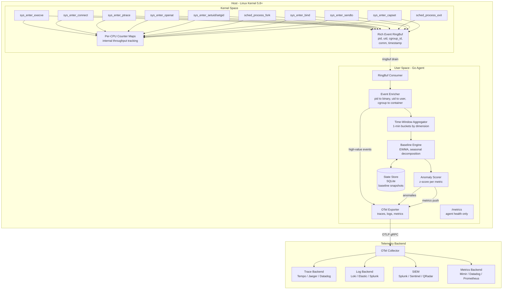
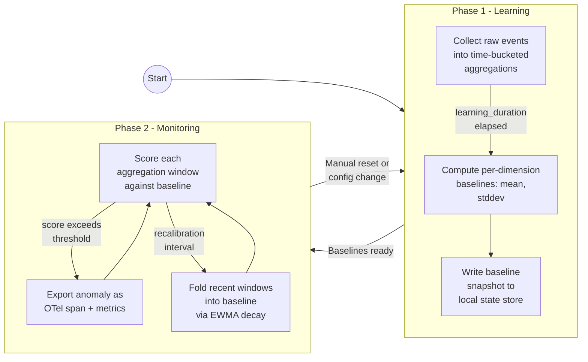
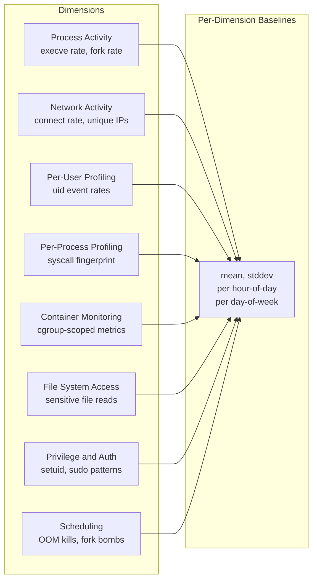
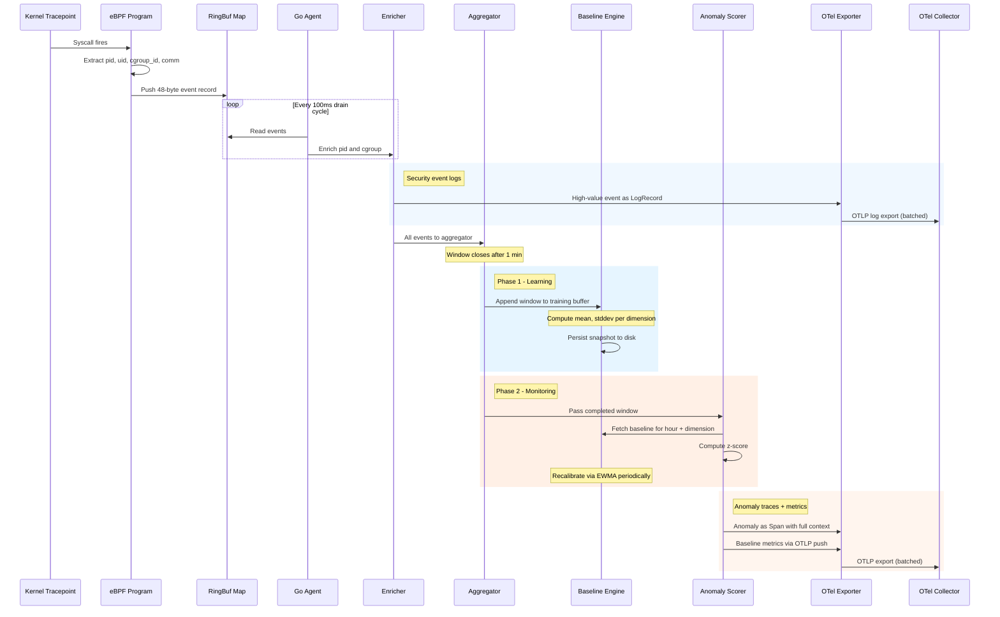
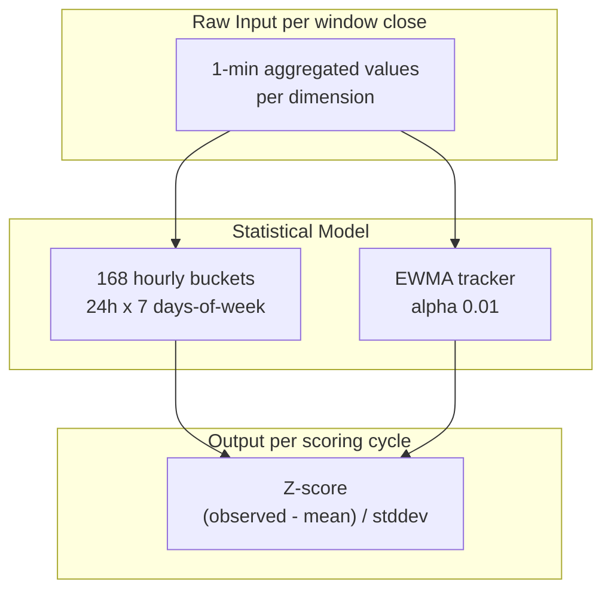
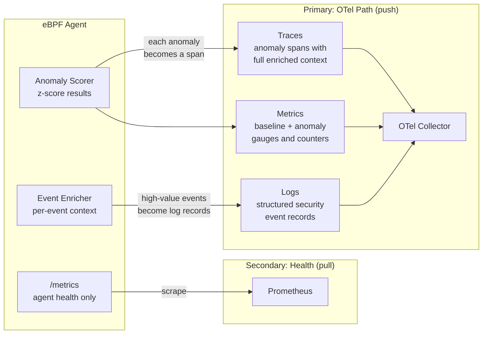
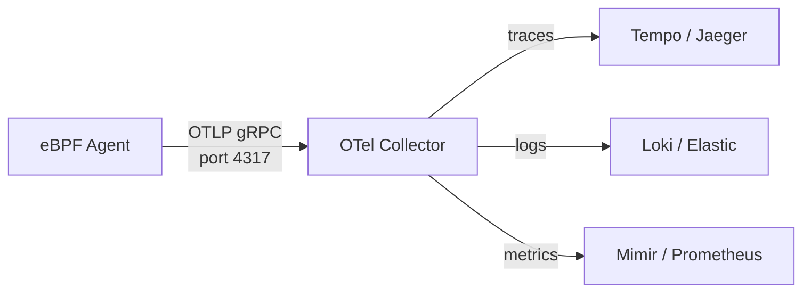
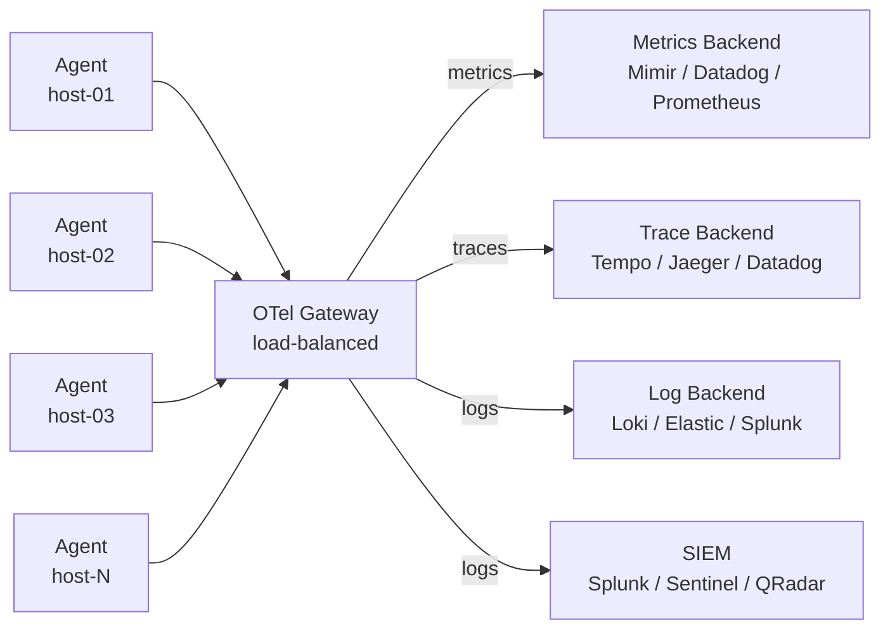
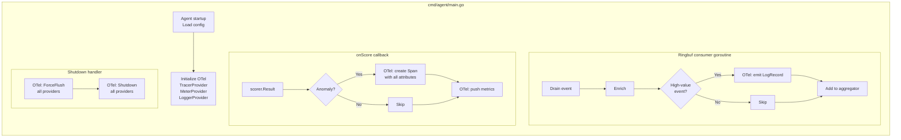

# Architecture

## Overview

The eBPF adaptive security agent is a two-phase, host-adapting monitoring system. It
attaches eBPF programs to kernel tracepoints, learns what "normal" looks like for each
host through statistical analysis, and detects deviations from that learned baseline.

The primary telemetry path is **OpenTelemetry** (push) — structured anomaly traces,
security event logs, and metrics via OTLP to any compatible backend. A minimal
Prometheus `/metrics` endpoint is retained for agent health monitoring only.

---

## High-Level Architecture



---

## Two-Phase Lifecycle



### Phase 1 — Learning (Baseline Establishment)

The agent collects events for a configurable duration (default: 7 days) to capture
weekday/weekend and day/night variance. During this phase:

- All events are aggregated into **1-minute buckets** per dimension (user, process, container, metric type).
- At the end of the learning period, the engine computes per-dimension statistics:
  - **Mean** and **standard deviation** (overall and per hour-of-day / day-of-week).
  - **Exponentially Weighted Moving Average (EWMA)** for trend tracking.
- The baseline snapshot is persisted to disk so the agent survives restarts without re-learning.

### Phase 2 — Monitoring (Anomaly Detection)

Each aggregation window (default: 1 minute) is scored against the stored baseline:

- **Z-score**: `(observed - mean) / stddev` per dimension, per hour-of-day bucket.
- Scores above a configurable threshold (default: 3.0) are flagged as anomalies.
- The baseline itself slowly adapts via EWMA decay (`α = 0.01`) so seasonal drift
  does not cause permanent false positives.
- A **recalibration interval** (default: 24h) folds the last day's data into
  the running baseline.

---

## Monitoring Dimensions

The adaptive system breaks monitoring into **eight orthogonal dimensions**, each producing
its own baseline profile.



### Detailed Metric Catalog

Metrics marked as **Planned** are not yet implemented and represent future expansion targets.

| Dimension | Metric | Source (tracepoint / kprobe) | Baseline Granularity | Status |
|---|---|---|---|---|
| **Process** | `exec_rate` | `sys_enter_execve` | per-host, per-user, per-hour | Implemented |
| **Process** | `fork_rate` | `sched_process_fork` | per-host, per-hour | Implemented |
| **Process** | `short_lived_process_count` | `sched_process_exit` (lifetime < 1s) | per-host, per-hour | Partial (exit events captured, lifetime filtering planned) |
| **Network** | `connect_rate` | `sys_enter_connect` | per-host, per-user, per-hour | Implemented |
| **Network** | `unique_dest_ips` | `sys_enter_connect` (IPv4 dedup) | per-host, per-hour | Planned |
| **Network** | `listening_port_count` | `sys_enter_bind` | per-host, per-container | Implemented |
| **Network** | `dns_query_rate` | `sys_enter_sendto` (port 53 filter) | per-host, per-hour | Implemented |
| **Network** | `bytes_tx` / `bytes_rx` | `cgroup/skb` or `sock_sendmsg` | per-container, per-hour | Planned |
| **Per-User** | `uid_exec_rate` | `sys_enter_execve` + `bpf_get_current_uid_gid` | per-uid, per-hour | Implemented |
| **Per-User** | `uid_priv_escalation_rate` | `sys_enter_setuid` | per-uid | Implemented |
| **Per-User** | `uid_sensitive_file_rate` | `sys_enter_openat` | per-uid | Implemented |
| **Per-Process** | `comm_syscall_profile` | all traced syscalls + `bpf_get_current_comm` | per-comm, per-day | Implemented |
| **Per-Process** | `comm_child_spawn_rate` | `sched_process_fork` | per-comm | Implemented |
| **Container** | `cgroup_exec_rate` | `sys_enter_execve` + `bpf_get_current_cgroup_id` | per-cgroup, per-hour | Implemented |
| **Container** | `cgroup_connect_rate` | `sys_enter_connect` + cgroup | per-cgroup, per-hour | Implemented |
| **Container** | `cgroup_fork_rate` | `sched_process_fork` + cgroup | per-cgroup, per-hour | Implemented |
| **File System** | `sensitive_file_access_rate` | `sys_enter_openat` (path filter) | per-host, per-hour | Implemented |
| **File System** | `tmp_file_creation_rate` | `sys_enter_openat` (O_CREAT + `/tmp`) | per-host, per-hour | Planned |
| **File System** | `file_write_rate` | `sys_enter_write` (sampled) | per-host, per-hour | Planned |
| **Privilege** | `sudo_rate` | `sys_enter_execve` (path match) | per-host, per-hour | Implemented |
| **Privilege** | `setuid_rate` | `sys_enter_setuid` | per-host | Implemented |
| **Privilege** | `capability_change_rate` | `sys_enter_capset` | per-host | Implemented |
| **Scheduling** | `oom_kill_count` | `oom/oom_kill` tracepoint | per-host | Planned |
| **Scheduling** | `fork_bomb_score` | `sched_process_fork` (rate spike per-pid) | per-host, per-minute | Planned |

---

## Data Flow — Kernel to Anomaly Score



---

## eBPF Layer

The BPF programs emit structured events to a ringbuf for the baseline and OTel pipelines.
Per-CPU counters are retained as lightweight internal throughput indicators.

### Structured Event (`bpf/exec.bpf.c`)

```c
struct event {
    __u64 timestamp_ns;
    __u32 pid;
    __u32 uid;
    __u64 cgroup_id;
    __u8  event_type;   // EXEC, CONNECT, PTRACE, OPENAT, SETUID, FORK, ...
    __u8  flags;        // IS_SUDO, IS_SUSPICIOUS_PORT, IS_SENSITIVE_FILE, ...
    __u16 dest_port;    // for connect events
    __u32 dest_ip;      // for connect events
    char  comm[16];     // process name (TASK_COMM_LEN)
};
```

Each tracepoint program fills this 48-byte struct and pushes it to a shared `BPF_MAP_TYPE_RINGBUF`.
The ringbuf is the primary data path — it feeds enrichment, baselining, and OTel export.
Per-CPU counters are retained as fast internal throughput indicators for agent health metrics.

### Tracepoints

| Tracepoint | BPF Function | Purpose |
|---|---|---|
| `sys_enter_execve` | `trace_exec` | Execution events, sudo, passwd reads |
| `sys_enter_connect` | `trace_connect` | Outbound connections, C2 port detection |
| `sys_enter_ptrace` | `trace_ptrace` | Process injection detection |
| `sys_enter_openat` | `trace_openat` | Sensitive file access |
| `sys_enter_setuid` | `trace_setuid` | Privilege escalation |
| `sys_enter_setgid` | `trace_setgid` | Privilege escalation |
| `sched_process_fork` | `trace_fork` | Fork rate, fork bomb detection |
| `sched_process_exit` | `trace_exit` | Process lifetime tracking |
| `sys_enter_bind` | `trace_bind` | New listening ports (backdoor detection) |
| `sys_enter_sendto` | `trace_sendto` | DNS query detection (port 53 filter) |
| `sys_enter_capset` | `trace_capset` | Capability changes |

### Enricher — Known Bottleneck

The enricher resolves PIDs to binary paths via `readlink(/proc/[pid]/exe)` — one syscall
per event with no caching. On a host processing 1000+ events/second, this adds significant
overhead. Additionally, short-lived processes (fork, exec, exit in <1ms) may have their
PID recycled before the enricher reads `/proc`, resulting in either an empty binary path
or the wrong binary entirely (TOCTOU race).

**Planned fix:** bounded LRU cache keyed by PID with a short TTL (5-10 seconds). The
UID cache already exists (loaded from `/etc/passwd` at startup) — the same pattern
needs to be applied to PID resolution. Enrichment failures (`Binary: ""`) should be
explicitly tagged in OTel log records so downstream consumers know the process exited
before resolution.

---

## Baseline Engine — Statistical Model



### Why 168 Hourly Buckets

Most host behavior is **seasonal**: build servers spike during business hours, cron jobs
fire at midnight, backup agents run on Sundays. A flat mean/stddev misses these patterns
entirely. By maintaining separate statistics for each **(hour-of-day, day-of-week)** pair:

- Monday 3am has its own mean/stddev
- Tuesday 2pm has its own mean/stddev
- A cron job that runs at 4am every day will not trigger an alert after the first week

### EWMA for Drift

Infrastructure changes over time — new services deploy, traffic patterns shift. Pure
historical baselines become stale. EWMA with a low alpha (0.01) slowly adapts the
baseline so that gradual, legitimate changes are absorbed without manual recalibration.

### Known Limitations and Mitigations

**Zero/low standard deviation.** When a dimension has near-constant values (e.g., a
cron job that always produces exactly 5 events), stddev approaches zero. The current
scorer produces `+Inf` z-scores for any deviation, causing false positives. **Mitigation
(planned):** enforce a configurable minimum stddev floor (e.g., `min_stddev: 1.0`) so
that small absolute deviations from constant patterns are not treated as infinite anomalies.

**Heavy-tailed distributions.** Syscall counts from web servers, build agents, and
CI runners are not normally distributed — they have long right tails. Z-scores assume
normality and over-flag legitimate burst events. **Mitigation (planned):** add Median
Absolute Deviation (MAD) as an alternative scoring mode for dimensions with high skewness.
MAD is robust to outliers: `MAD = median(|xi - median(x)|)`, and the modified z-score
`0.6745 * (observed - median) / MAD` handles heavy tails without assuming normality.
The scorer would select z-score or MAD per dimension based on measured skewness during
the learning phase.

**Cold-start for new dimensions.** If a new user, process, or container appears after
the learning phase completes, it has no baseline entry. The current scorer returns
`ready=false` and silently skips it — no scoring, no alert. A new container or user
account is invisible to anomaly detection until the next recalibration absorbs it.
**Mitigation (planned):** implement a cold-start policy that flags unseen dimensions
as anomalous by default (configurable severity), and fast-tracks them into the baseline
with a compressed learning window (e.g., 24h instead of 7d) while emitting an OTel
log record indicating a new dimension was observed.

**Evasion via gradual escalation.** EWMA decay means an attacker who slowly increases
activity over weeks can shift the baseline until their behavior appears normal. This
is inherent to any adaptive system. **Mitigation:** expose absolute ceiling thresholds
alongside relative z-score detection, and emit OTel metrics for `ebpf_baseline_mean`
so operators can set hard upper bounds that EWMA cannot erode.

---

## Telemetry Export

OpenTelemetry is the **primary export path** for all security detection output. The
agent produces three OTel signal types — traces, logs, and metrics — that carry the
full enriched context from the detection pipeline. A minimal Prometheus `/metrics`
endpoint is retained exclusively for agent operational health.

### Why OTel-Primary

The agent's detection logic (z-score computation, seasonal baselining, EWMA drift,
evasion detection) runs inside compiled Go code. OTel exports the **results** — enriched
anomaly spans, structured security event logs, and pushed metrics — without exposing
the scoring internals. This is a deliberate architectural choice: downstream systems
consume finished intelligence, not raw data they need to re-process.

Prometheus scrape is fundamentally the wrong model for a security agent. It requires
inbound reachability to the agent (breaks behind firewalls/NAT), loses all per-event
context (only aggregated counters survive), and forces detection logic into PromQL
rules that are plain-text YAML — readable, copyable, and trivially reproducible.

### Export Architecture



### Prometheus — Agent Health Only

The `/metrics` endpoint exposes **operational health metrics**, not security detection.

| Metric | Type | Description |
|---|---|---|
| `ebpf_agent_info` | Gauge | Agent metadata: version, host, phase |
| `ebpf_baseline_phase` | Gauge | 1=learning, 2=monitoring |
| `ebpf_baseline_progress` | Gauge | 0.0-1.0 during learning |
| `ebpf_events_processed_total` | Counter | Total events processed (throughput) |
| `ebpf_ringbuf_drops_total` | Counter | Events dropped due to backpressure |
| `ebpf_otel_export_errors_total` | Counter | Failed OTel export batches |

These answer "is the agent working" — not "is the host compromised." Security detection
output (anomaly scores, baseline context, enriched events) flows exclusively through OTel.

### OpenTelemetry — Three Signal Types

OTel taps into the existing pipeline at three points. Each signal type carries the full
enriched context that the agent's internal pipeline produces.

#### Signal 1: Traces (Anomaly Spans)

**Source**: The `onScore` callback in `main.go`.

Each anomaly produces one span carrying: which user, which process, which container,
the observed count vs. the baseline mean, the standard deviation, the seasonal bucket
index, the MITRE technique ID, and a severity label. This is the primary detection
output — queryable, searchable, and correlatable across hosts and time windows.

#### Signal 2: Logs (Security Event Records)

**Source**: The enrichment goroutine in `main.go`, after enrichment, before aggregation.

Individual security-relevant events (ptrace, capset, suspicious connect, sensitive file
access) are preserved as structured log records with nanosecond timestamps, full enrichment
(binary path, username, container), raw BPF fields (dest IP/port, flags), and MITRE
technique IDs. This is the audit trail that SIEMs need for correlation, timeline
reconstruction, and forensics.

#### Signal 3: Metrics (OTLP Push)

**Source**: The baseline engine and scorer.

Baseline means, standard deviations, anomaly scores, and anomaly counts are pushed via
OTLP. Push removes the requirement for network reachability from a metrics server to
the agent — the agent initiates all connections outbound.

### OTel Attribute Schema

#### Resource Attributes (set once at startup)

| Attribute | Source | Example |
|---|---|---|
| `service.name` | config: `otel.resource_attributes.service.name` | `ebpf-agent` |
| `service.version` | build-time constant | `3.0.0` |
| `host.id` | `config.Host.ID` (auto-detected) | `a1b2c3d4...` |
| `host.name` | `os.Hostname()` | `web-prod-03` |
| `deployment.environment` | `config.Host.Labels["environment"]` | `production` |
| `host.role` | `config.Host.Labels["role"]` | `webserver` |

#### Anomaly Span Attributes

| Attribute | Type | Source | Example |
|---|---|---|---|
| `ebpf.anomaly.metric` | string | `Result.Key.MetricName` | `exec` |
| `ebpf.anomaly.dimension.user` | string | `Result.Key.User` | `root` |
| `ebpf.anomaly.dimension.process` | string | `Result.Key.Process` | `curl` |
| `ebpf.anomaly.dimension.container` | string | `Result.Key.Container` | `cgroup:4026531835` |
| `ebpf.anomaly.observed` | float64 | `Result.Observed` | `247.0` |
| `ebpf.anomaly.baseline_mean` | float64 | `Result.Mean` | `42.3` |
| `ebpf.anomaly.baseline_stddev` | float64 | `Result.StdDev` | `8.1` |
| `ebpf.anomaly.zscore` | float64 | `Result.ZScore` | `25.3` |
| `ebpf.anomaly.threshold` | float64 | config | `3.0` |
| `ebpf.anomaly.severity` | string | derived | `warning` |
| `ebpf.anomaly.seasonal_bucket` | int | `baseline.SeasonalIndex()` | `75` |
| `ebpf.anomaly.window_start` | timestamp | `Window.Start` | `2026-03-24T14:00:00Z` |
| `ebpf.anomaly.window_end` | timestamp | `Window.End` | `2026-03-24T14:01:00Z` |
| `mitre.technique.id` | string | mapped from metric name | `T1059` |
| `mitre.technique.name` | string | mapped from metric name | `Command and Scripting Interpreter` |

#### Security Event Log Attributes

| Attribute | Type | Source | Example |
|---|---|---|---|
| `ebpf.event.type` | string | `eventTypeToMetric()` | `ptrace` |
| `ebpf.event.type_id` | int | `Event.EventType` | `3` |
| `ebpf.event.timestamp_ns` | int64 | `Event.TimestampNs` | `1711288800000000000` |
| `ebpf.event.pid` | int | `Event.PID` | `4521` |
| `ebpf.event.uid` | int | `Event.UID` | `1000` |
| `ebpf.event.comm` | string | `Event.CommString()` | `strace` |
| `ebpf.event.binary` | string | `EnrichedEvent.Binary` | `/usr/bin/strace` |
| `ebpf.event.username` | string | `EnrichedEvent.Username` | `deploy` |
| `ebpf.event.container` | string | `EnrichedEvent.Container` | `cgroup:4026531835` |
| `ebpf.event.cgroup_id` | int64 | `Event.CgroupID` | `4026531835` |
| `ebpf.event.dest_ip` | string | formatted from `Event.DestIP` | `192.168.1.100` |
| `ebpf.event.dest_port` | int | `Event.DestPort` | `4444` |
| `ebpf.event.flags` | string[] | decoded from `Event.Flags` | `["sudo", "suspicious_port"]` |
| `mitre.technique.id` | string | mapped from event type | `T1055` |
| `mitre.technique.name` | string | mapped from event type | `Process Injection` |

### OTel Event Severity and Export Policy

Not every enriched event is exported as a log record. The exporter applies a severity filter:

| Event Type | OTel Severity | Export Policy |
|---|---|---|
| `ptrace` | FATAL | Always export |
| `suspicious_connect` | ERROR | Always export |
| `capset` | ERROR | Always export |
| `sensitive_file` | WARN | Always export |
| `setuid` / `setgid` | WARN | Always export |
| `sudo` | WARN | Always export |
| `bind` | INFO | Sample (configurable rate) |
| `connect` | INFO | Sample (configurable rate) |
| `dns` | DEBUG | Sample (configurable rate) |
| `exec` | DEBUG | Sample (configurable rate) |
| `fork` / `exit` | TRACE | Off by default |

### MITRE ATT&CK Mapping

The agent maps kernel events to MITRE ATT&CK technique IDs on OTel trace and log
attributes. The current implementation is a **static 1:1 lookup** — a starting point,
not the target architecture.

#### Current: Static Lookup (Implemented)

| Event Type | Technique ID | Technique Name |
|---|---|---|
| `exec`, `sudo` | T1059 | Command and Scripting Interpreter |
| `connect`, `suspicious_connect` | T1071 | Application Layer Protocol |
| `ptrace` | T1055 | Process Injection |
| `sensitive_file`, `passwd_read` | T1003 | OS Credential Dumping |
| `setuid`, `setgid`, `capset` | T1548 | Abuse Elevation Control Mechanism |
| `bind` | T1046 | Network Service Discovery |
| `dns` | T1071.004 | DNS |
| `fork` | T1106 | Native API |

This is a flat map: event type in, single technique ID out. It ignores enrichment
context, produces no sub-technique granularity, has no tactic dimension, and treats
every event of the same type identically.

#### Planned: Context-Aware Mapping Engine

The static table conflates events that belong to different techniques depending on
context. A full MITRE implementation uses the enriched event fields (binary path,
`comm`, username, container, flags, destination port/IP) to select the correct
technique and sub-technique.

**Sub-technique resolution.** An `exec` event is not always T1059. The enricher
provides the binary path and `comm` — enough to distinguish:

| Enriched Context | Technique | Sub-Technique |
|---|---|---|
| `comm=bash`, `binary=/bin/bash` | T1059.004 | Unix Shell |
| `comm=python3`, `binary=/usr/bin/python3` | T1059.006 | Python |
| `comm=cron`, parent=`crond` | T1053.003 | Cron |
| `binary` path != `comm` (name mismatch) | T1036.003 | Rename System Utilities |
| `exec` from interactive TTY | T1204.002 | User Execution: Malicious File |

**Multi-technique attribution.** A single event can map to multiple techniques.
A `connect` to port 443 with a DNS lookup to a DGA-pattern domain is simultaneously
T1071.001 (Web Protocols) and T1568.002 (Domain Generation Algorithms). The mapper
should emit an array of `mitre.technique.id` values per OTel span/log, not a single
string.

**Tactic dimension.** Techniques belong to tactics (the "why"). The same technique
appears under different tactics depending on intent — `bind` is Discovery (T1046)
if it's a port scan, but Persistence (T1205) if it's a backdoor listener. The mapper
needs a `mitre.tactic` attribute alongside the technique:

| Tactic | Relevant Agent Detections |
|---|---|
| Execution | exec, sudo, fork |
| Persistence | bind (new port), cron exec, setuid on binary |
| Privilege Escalation | setuid, setgid, capset, sudo |
| Defense Evasion | process name mismatch, short-lived process |
| Credential Access | sensitive_file (passwd, shadow, keys) |
| Discovery | bind (scan), dns (recon) |
| Lateral Movement | connect to internal subnets |
| Command and Control | connect to suspicious port/IP, dns to DGA domain |
| Exfiltration | connect with high bytes_tx (planned) |

**Temporal correlation (future).** Individual events are low-confidence signals.
Real ATT&CK value comes from recognizing sequences across time windows — exec
followed by connect followed by DNS on a non-standard port within the same process
tree is a kill chain (Execution -> C2 -> Exfiltration). This requires cross-span
correlation in the mapper, producing a parent span that links the individual event
spans into an attack chain. This is the highest-value MITRE capability and the
hardest to replicate — it depends on the agent's enrichment, baseline context, and
temporal window state, none of which are visible in exports.

---

## Deployment Topology

### Single Host



### Fleet (Multi-Host)



In both topologies, the agent initiates all connections outbound. No inbound ports
need to be open on the monitored host — the agent pushes to the collector, not the
other way around. This is critical for security monitoring: the agent remains operational
even if the host is behind a firewall, NAT, or its network is partially compromised.

---

## Agent Configuration

```yaml
baseline:
  learning_duration: 168h          # 7 days
  aggregation_window: 1m
  recalibration_interval: 24h
  ewma_alpha: 0.01
  min_stddev: 1.0                  # floor to avoid +Inf z-scores (planned)
  state_file: /var/lib/ebpf-agent/baseline.db

scoring:
  zscore_threshold: 3.0            # flag if z > 3.0
  minimum_samples: 60              # need 60 windows before scoring
  cold_start_severity: warning     # severity for unseen dimensions (planned)

host:
  id: ""                           # auto-detect from /etc/machine-id
  labels:
    environment: production
    role: webserver

container_monitoring:
  enabled: true
  cgroup_root: /sys/fs/cgroup

dimensions:
  per_user: true
  per_process: true
  per_container: true
  network: true
  filesystem: true
  scheduling: true

# Primary telemetry export — all detection output flows through OTel
otel:
  enabled: true                    # primary export path
  endpoint: "localhost:4317"       # OTLP collector address
  protocol: grpc                   # grpc or http
  insecure: true                   # disable TLS to collector (set false in prod)
  headers: {}                      # auth headers for production
  export_metrics: true
  export_traces: true              # anomaly spans
  export_logs: true                # security event logs
  metric_export_interval: 60s
  sampling:
    ptrace: 1.0
    suspicious_connect: 1.0
    capset: 1.0
    sensitive_file: 1.0
    setuid: 1.0
    sudo: 1.0
    bind: 0.1
    connect: 0.01
    dns: 0.01
    exec: 0.01
    fork: 0.0
    exit: 0.0
  batch:
    max_queue_size: 8192
    max_export_batch: 512
    export_timeout: 30s
  resource_attributes:
    service.name: "ebpf-agent"
    deployment.environment: ""     # auto-filled from host.labels.environment

# Minimal health endpoint — agent operational metrics only
prometheus:
  enabled: true                    # /metrics for agent health
  listen: ":9090"
```

---

## OTel Integration Points



The OTel exporter package (`internal/otelexport/`) exposes four functions:

- `Init(cfg, hostID, hostLabels)` — called at startup, initializes providers
- `EmitAnomaly(result, window)` — called from `onScore` for each anomaly
- `EmitSecurityEvent(ev)` — called from ringbuf goroutine for high-value events
- `Shutdown(ctx)` — called during graceful termination, flushes and closes

No changes to `internal/ringbuf/`, `internal/enricher/`, `internal/aggregator/`,
`internal/baseline/`, `internal/scorer/`, `internal/store/`, or `internal/phase/`.

---

## Implementation Status

| Component | Package | Status |
|---|---|---|
| BPF ringbuf + structured events | `bpf/exec.bpf.c` | Done |
| New tracepoints (fork, exit, bind, dns, capset) | `bpf/exec.bpf.c` | Done |
| RingBuf consumer | `internal/ringbuf/` | Done |
| Event enricher with LRU PID cache | `internal/enricher/` | Done |
| Time-window aggregator | `internal/aggregator/` | Done |
| 168-bucket seasonal baseline + EWMA | `internal/baseline/` | Done |
| Z-score scorer with min stddev floor + cold-start | `internal/scorer/` | Done |
| Optional MAD scorer + per-metric ceilings | `internal/scorer/` | Done (`mad_enabled`, `ceilings`) |
| Context-aware MITRE ATT&CK mapper | `internal/mitre/` | Done |
| SQLite state persistence | `internal/store/` | Done |
| Phase management (learning/monitoring) | `internal/phase/` | Done |
| Agent health Prometheus metrics | `cmd/agent/main.go` | Done |
| OTel exporter package (OTLP gRPC) | `internal/otelexport/` | Done |
| OTel config section | `internal/config/` | Done |
| OTel wiring in main.go | `cmd/agent/main.go` | Done |
| IPv6 + openat differentiation + `unique_dest_ips` | `bpf/`, `ringbuf/`, `aggregator/` | Done |
| MITRE temporal kill chain correlation | `internal/mitre/` | Planned (placeholder `chain.go`) |
| BPF program test harness | `bpf/` | Partial (`//go:build bpf_test` stub) |
| Full integration test harness | `internal/integration/` | Partial (`//go:build integration` placeholder) |

The **Full Implementation Roadmap** (phases 1–6, `issues.md` fixes, ARCHITECTURE alignment) is **complete** as of 2026-04-02 — see [state.md](state.md).

### Next implementation priorities

Work **after** that roadmap, ordered roughly by leverage and dependencies:

1. **OpenTelemetry follow-ups** — Rich **LogRecord** emission for security events (spans exist today); wire reserved **`otel.headers`** and **`otel.batch`** to gRPC/SDK or narrow the config surface; optional **baseline / health gauges** via OTLP metrics instruments.
2. **Scorer** — **Skewness-based** automatic choice of MAD vs z-score; fully wire **`baseline.new_dimension_learn_window`** (cold-start fast-track) in phase/scorer (config exists; logic incomplete).
3. **Detection coverage** (ARCHITECTURE metric catalog) — e.g. `tmp_file_creation_rate`, **`sys_enter_write`** / `file_write_rate`, **`oom/oom_kill`**, fork-bomb / short-lived process metrics, **bytes_tx/rx**; deeper items: full argv, LD_PRELOAD, DNS tunneling heuristics.
4. **MITRE** — **Temporal kill-chain** correlation and OTel parent/child spans (beyond `chain.go` stub).
5. **Reliability & ops** — Enricher **TOCTOU** mitigation (TTL/retry); structured log format; **`/metrics`** hardening.
6. **Testing** — Non-placeholder **integration** pipeline tests, **BPF** tests beyond stub, benchmarks / fuzz / anomaly replay.

---

## Key Design Decisions

### 1. Agent-side detection, OTel-exported results

All detection logic (baselining, z-score computation, seasonal decomposition, evasion
detection) runs **inside the agent binary**. OTel exports the **results** — enriched
anomaly spans, structured security event logs, and pushed metrics — without exposing
the scoring internals.

**Rationale:**
- The agent has access to raw per-event context (pid, uid, cgroup, binary path) that
  cannot be reconstructed from aggregated metrics.
- Detection logic in compiled Go is not readable from the export data. Downstream
  consumers see `ebpf.anomaly.zscore: 4.7` but not the seasonal bucketing, the
  minimum stddev floor, or the evasion detection algorithm that produced it.
- Push-based export means the agent works behind firewalls, NAT, and on ephemeral
  hosts — critical for security monitoring where network restrictions are the norm.

### 2. RingBuf over HashMap for event transfer

RingBuf (`BPF_MAP_TYPE_RINGBUF`) is preferred over per-CPU hash maps for rich events
because it provides:
- Variable-length event support.
- Automatic backpressure (drops events under load rather than corrupting data).
- Single consumer in userspace (simpler than iterating per-CPU maps).

Per-CPU counter maps are retained as lightweight internal throughput indicators.

### 3. SQLite for state persistence

Baseline snapshots are stored in a local SQLite database rather than flat files:
- Atomic writes (no corruption on power loss).
- Queryable (useful for debugging: "show me the baseline for uid 1000 at 3am Monday").
- Single file, no dependencies beyond `modernc.org/sqlite` (pure Go, no CGO).

### 4. Minimum 7-day learning period

Shorter windows (1–2 days) miss weekend vs. weekday patterns. A full week captures
the typical `168h` cycle. The agent rejects entering Phase 2 until `minimum_samples`
windows are collected per dimension per hourly bucket, ensuring statistical validity.

### 5. Per-event OTel logs vs. aggregated metrics

OTel logs export **individual enriched events** (not aggregated counts). This is
intentional — SIEMs need per-event records for correlation, timeline reconstruction,
and forensics. The aggregator still receives every event for baselining; the OTel log
path is a parallel fork, not a diversion.

### 6. Prometheus for health, not detection

The `/metrics` endpoint is intentionally minimal — agent uptime, phase status, throughput,
error rates. Security detection output flows exclusively through OTel. This avoids:
- **Duplicate code paths** maintaining two export systems for the same data.
- **Context loss** — Prometheus counters discard per-event enrichment.
- **Cardinality pressure** — per-user × per-process × per-container dimensions
  produce thousands of series per host, which Prometheus is not designed for.
- **Pull model mismatch** — security agents should push, not wait to be scraped.

---

## Security Considerations

- **Ringbuf size**: Capped at 256KB to prevent memory pressure under event storms.
  Events are dropped rather than consuming unbounded memory.
- **State file permissions**: `/var/lib/ebpf-agent/baseline.db` must be root-owned
  (`0600`). An attacker with write access could poison the baseline.
- **Gradual poisoning**: EWMA decay means an attacker who slowly escalates activity
  over weeks could shift the baseline. Mitigation: expose absolute ceiling thresholds
  via OTel metrics alongside relative z-score detection.
- **Learning phase vulnerability**: During Phase 1, there are no adaptive alerts.
  The OTel exporter still emits high-value security event logs (ptrace, capset,
  suspicious connections) during learning — the audit trail is never interrupted.
- **OTel collector trust**: The OTLP endpoint receives all security events. The
  collector must be secured (TLS, authentication) and treated as a high-value target.
  Configure `otel.insecure: false` and `otel.headers` with auth tokens in production.
- **Enricher TOCTOU**: Short-lived processes may exit before the enricher reads
  `/proc/[pid]/exe`. The enrichment failure should be explicitly tagged in OTel
  log records so consumers can distinguish "failed to resolve" from "host process".

---

## Testing Strategy

### Go Unit Tests

All Go packages (`internal/baseline/`, `internal/scorer/`, `internal/aggregator/`,
`internal/phase/`, `internal/config/`) are tested with standard `go test`. These
cover the statistical logic, scoring thresholds, window rotation, phase transitions,
and configuration validation. Run with `make test` or `go test ./...`.

### BPF Program Testing (Planned)

The eBPF C programs currently have no automated tests. This is a known gap — changes
to the BPF layer are validated manually by loading the agent, triggering events, and
inspecting `/metrics` or ringbuf output. Planned approaches:

**`BPF_PROG_RUN` (preferred).** The kernel's `bpf(BPF_PROG_TEST_RUN)` syscall allows
running a loaded BPF program against a synthetic context without attaching it to a
real tracepoint. This enables deterministic unit testing of individual BPF programs:
craft a `struct trace_event_raw_sys_enter` with known fields, call `BPF_PROG_RUN`,
verify the counter map delta and the ringbuf event bytes. The `cilium/ebpf` library
supports this via `Program.Run()`.

**Go integration harness (fallback).** For tracepoints where `BPF_PROG_RUN` context
fabrication is complex, a Go test can: load the BPF programs, attach to real tracepoints,
trigger controlled syscalls (e.g., `exec.Command("true").Run()`, `syscall.Connect()`),
drain the ringbuf, and assert on the emitted events. This is slower and less deterministic
but validates the full kernel-to-userspace path.

**CI considerations.** Both approaches require `CAP_BPF` and a kernel with the target
tracepoints. CI runs need either a privileged container with a recent kernel or a
dedicated VM. The test harness should be gated behind a `//go:build integration` tag
to keep `make test` fast and unprivileged by default.

---

## Open-Core Strategy

The agent follows an **open-core model**: the full detection agent is open-source (MIT),
and advanced capabilities are developed in a separate private repository as a commercial
tier.

### What is open-source (this repo)

Everything needed to run a fully functional adaptive security agent:

- All BPF programs (tracepoints, ringbuf, counter maps, flag logic)
- RingBuf consumer, enricher with LRU PID cache, aggregator
- 168-bucket seasonal baseline engine with EWMA drift adaptation
- Z-score anomaly scorer with minimum stddev floor and cold-start policy
- Context-aware MITRE ATT&CK mapper (sub-technique resolution, multi-technique
  attribution, tactic assignment)
- SQLite state persistence, phase management
- OTel exporter with three signal types (traces, logs, metrics)
- Full configuration system, systemd service, health endpoint

This is a real, deployable security agent — not a crippled demo. Community users
get production-grade kernel-level monitoring, adaptive baselining, and structured
OTel export.

### Where a commercial tier builds on top

The open-source agent defines **Go interfaces** at the scoring and mapping boundaries.
A private module can implement these interfaces to add capabilities without modifying
the open-source code:

| Capability | Open-Source | Commercial (planned) |
|---|---|---|
| Anomaly scoring | Z-score with stddev floor | MAD scorer with auto-selection based on skewness, multi-variate correlation across dimensions |
| MITRE mapping | Context-aware sub-techniques, tactic assignment | Temporal kill chain correlation (cross-event attack chain detection via parent spans) |
| Cold-start | Flag + configurable severity | Compressed learning window (24h fast-track) with Bayesian priors from fleet data |
| Enrichment | LRU-cached PID resolution | Process tree reconstruction, parent-child lineage tracking |
| Fleet features | Single-agent (independent) | Cross-host correlation via OTel Gateway, fleet-wide baseline sharing |
| Managed backend | Self-hosted OTel collector | Hosted backend with alerting, dashboards, SIEM integrations |
| Support | Community (GitHub issues) | SLA-backed enterprise support |

### Plugin boundary

The scorer and MITRE mapper are the natural extension points. The open-source agent
ships with concrete implementations (`internal/scorer/`, `internal/mitre/`). A
commercial build replaces these at compile time with enhanced implementations from
the private module — same interfaces, different logic. No runtime plugin loading,
no reflection, no overhead.

### Why this works

The open-source agent builds trust and adoption. Security teams can audit every line
of kernel instrumentation and detection logic. The commercial tier adds value on top
(fleet management, advanced scoring, hosted backend) rather than gating the core agent
behind a paywall. This matches the model of successful open-core security tools (Falco,
Wazuh, osquery) where the agent is open and the platform is commercial.

---

## OTel Dependencies

| Package | Purpose | Size Impact |
|---|---|---|
| `go.opentelemetry.io/otel` | Core OTel API | ~1 MB |
| `go.opentelemetry.io/otel/sdk` | Tracer/Meter/Logger providers | ~2 MB |
| `go.opentelemetry.io/otel/sdk/log` | Log SDK | ~0.5 MB |
| `go.opentelemetry.io/otel/exporters/otlp/otlptrace/otlptracegrpc` | Trace OTLP exporter | ~2 MB |
| `go.opentelemetry.io/otel/exporters/otlp/otlpmetric/otlpmetricgrpc` | Metric OTLP exporter | ~1 MB |
| `go.opentelemetry.io/otel/exporters/otlp/otlplog/otlploggrpc` | Log OTLP exporter | ~1 MB |
| `google.golang.org/grpc` | gRPC transport (shared) | ~3 MB |

Total additional binary size: approximately **6-8 MB** (gRPC is the bulk, shared across
all three exporters). All pure Go, no CGO.
