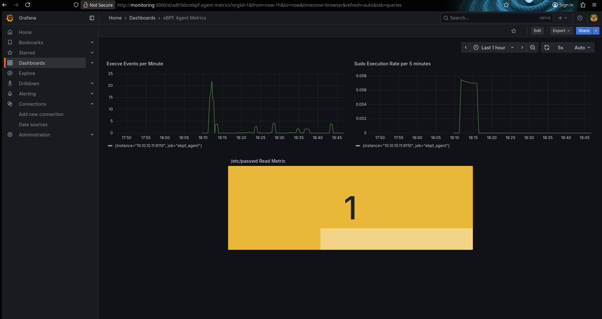
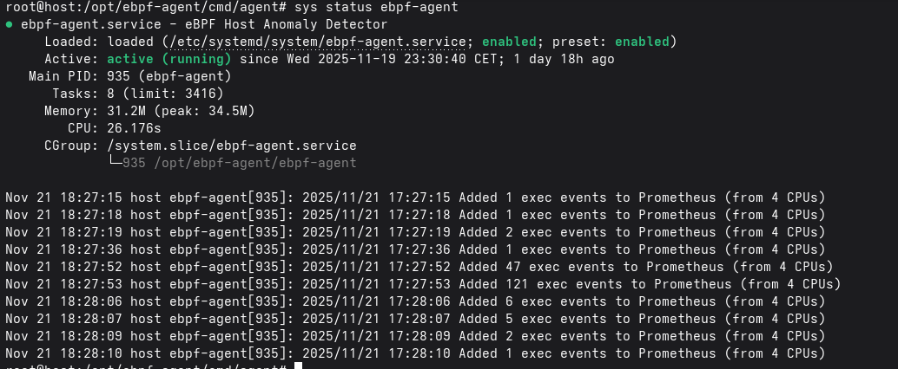
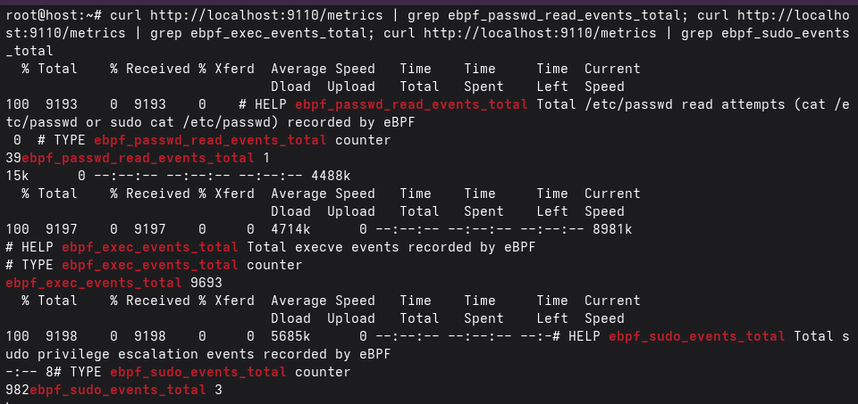
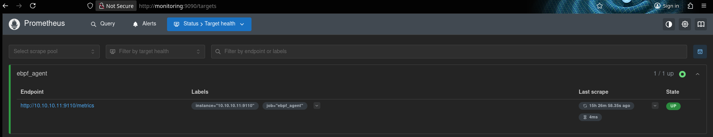
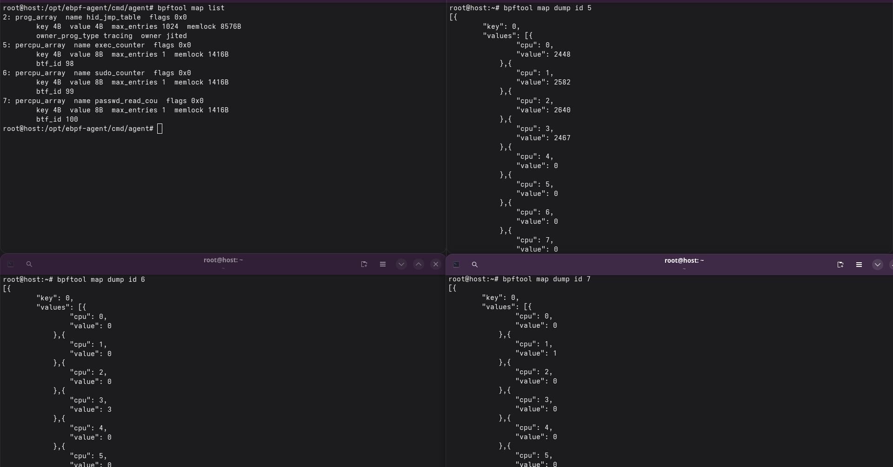
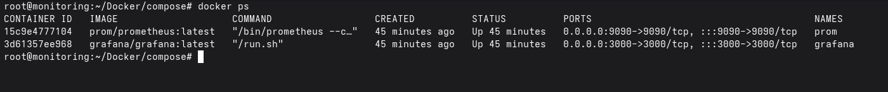

# eBPF Security Monitoring System

[](https://opensource.org/licenses/MIT)
[](https://golang.org/)
[](https://www.kernel.org/)
[](https://ebpf.io/)

A real-time security monitoring solution using eBPF (Extended Berkeley Packet Filter) to track system events and detect potential security threats. The system monitors command executions, privilege escalations, and sensitive file access attempts.

## Table of Contents

- [Why eBPF?](#why-ebpf)
- [Screenshots](#screenshots)
- [Features](#features)
- [Architecture](#architecture)
- [Prerequisites](#prerequisites)
- [Quick Start](#quick-start)
- [Configuration](#configuration)
- [Metrics](#metrics)
- [Development](#development)
- [Troubleshooting](#troubleshooting)
- [Security Considerations](#security-considerations)
- [Contributing](#contributing)
- [License](#license)

## Why eBPF?

Traditional security monitoring tools often rely on user-space instrumentation, which can be:
- **Bypassed**: Malicious actors can detect and evade user-space monitoring
- **Resource-intensive**: High CPU and memory overhead
- **Incomplete**: Miss events that occur at the kernel level

eBPF provides:
- ✅ **Kernel-level visibility**: Cannot be bypassed by user-space processes
- ✅ **Zero overhead**: Runs directly in the kernel with minimal performance impact
- ✅ **Safe**: eBPF verifier ensures programs cannot crash the kernel
- ✅ **Real-time**: Immediate event detection without polling

## Architecture

This project consists of two main components:

### 1. Host Agent (`host/ebpf-agent`)
An eBPF-based monitoring agent that runs on Linux hosts to track:
- All command executions (`execve` syscalls)
- Sudo privilege escalation attempts
- `/etc/passwd` file read attempts (via `cat` or `sudo cat`)

The agent exposes metrics via Prometheus format on port 9110.

### 2. Monitoring Stack (`monitoring`)
A complete monitoring infrastructure using Docker Compose:
- **Prometheus**: Metrics collection and alerting
- **Grafana**: Visualization and dashboards

## Screenshots

### Grafana Dashboard

*Real-time visualization of system security events with custom Grafana dashboard*

### eBPF Agent Running

*The eBPF agent actively monitoring execve syscalls and logging security events*

### Prometheus Metrics Endpoint

*Raw Prometheus metrics exposed by the eBPF agent on port 9110*

### Prometheus Metrics Query

*Querying and visualizing metrics in Prometheus*

### eBPF Map Inspection

*Inspecting eBPF maps using bpftool to verify kernel-level data collection*

### Docker Services

*Monitoring stack services running via Docker Compose*

## Features

- **Real-time Monitoring**: Uses eBPF tracepoints for zero-overhead kernel-level monitoring
- **Security Alerts**: Pre-configured alerts for suspicious activities
- **Prometheus Integration**: Standard metrics format for easy integration
- **Scalable**: Designed to monitor multiple hosts from a central monitoring server

## Prerequisites

### Host Agent
- Linux kernel 5.8+ (with eBPF support)
- Go 1.24+
- clang and llvm (for compiling eBPF programs)
- Kernel headers installed

### Monitoring Stack
- Docker and Docker Compose
- Network access to monitored hosts

## Quick Start

### 1. Deploy the Host Agent

On the host you want to monitor:

**Option A: Automated Installation (Recommended)**

```bash
# Clone the repository
git clone https://github.com/gr8pr1/ebpf-host-monitor.git
cd ebpf-host-monitor

# Run the quick-start script
sudo ./scripts/quick-start.sh
```

The script will:
- Install required dependencies
- Check kernel compatibility
- Build the eBPF agent
- Optionally install as a systemd service

**Option B: Manual Installation**

```bash
cd host/ebpf-agent

# Build the agent
make all

# Run manually
sudo ./ebpf-agent

# OR install as a service
make install
```

The agent will start monitoring and expose metrics on `http://localhost:9110/metrics`.

### 2. Deploy the Monitoring Stack

On your monitoring server:

```bash
cd monitoring/Docker/compose

# IMPORTANT: Edit prometheus.yml first
nano prometheus/prometheus.yml
# Replace YOUR_HOST_IP with your actual host IP

# Start all services
docker-compose up -d

# Verify services are running
docker-compose ps
```

Access the services:
- **Prometheus**: http://localhost:9090
- **Grafana**: http://localhost:3000 (default credentials: admin/admin)

### 3. Verify Everything Works

```bash
# On the host, check metrics
curl http://localhost:9110/metrics

# Generate some test events
ls
sudo ls
cat /etc/passwd

# Check Prometheus targets (should show "UP")
# Visit: http://localhost:9090/targets

# View metrics in Prometheus
# Visit: http://localhost:9090/graph
# Query: ebpf_exec_events_total
```

## Configuration

### Host Agent

The agent is configured to monitor:
- All `execve` syscalls
- Commands containing `sudo` in the path
- `cat /etc/passwd` and `sudo cat /etc/passwd` commands

Metrics are exposed on port 9110 by default. To change this, modify `cmd/agent/main.go`.

### Monitoring Stack

**Important**: Before starting the monitoring stack, you must update the target host IP addresses in `monitoring/Docker/compose/prometheus/prometheus.yml`:

```yaml
scrape_configs:
  - job_name: 'ebpf_agent'
    static_configs:
      - targets: ['YOUR_HOST_IP:9110']  # Replace with your actual host IP (e.g., 192.168.1.100:9110)
```

Replace `YOUR_HOST_IP` with the IP address of the server where the eBPF agent is running.

### Alert Rules

Pre-configured alerts in `monitoring/Docker/compose/prometheus/rules/alerts.yml`:

- **EBPFExporterDown**: Agent is unreachable
- **HighExecutionRate**: >10 exec/sec for 2 minutes
- **CriticalExecutionSpike**: >50 exec/sec for 1 minute
- **SudoUsageDetected**: Any sudo command execution
- **RapidSudoUsage**: >0.1 sudo/sec for 2 minutes

## Metrics

The eBPF agent exposes the following Prometheus metrics:

| Metric | Type | Description |
|--------|------|-------------|
| `ebpf_exec_events_total` | Counter | Total number of execve syscalls |
| `ebpf_sudo_events_total` | Counter | Total sudo command executions |
| `ebpf_passwd_read_events_total` | Counter | Total /etc/passwd read attempts |

## Development

### Building the eBPF Program

```bash
cd host/ebpf-agent/bpf

# Compile the eBPF program
clang -O2 -g -target bpf -c exec.bpf.c -o exec.bpf.o
```

The compiled object is embedded in the Go binary at build time.

### Inspecting eBPF Maps

You can inspect the eBPF maps directly using `bpftool`:

```bash
# List all eBPF programs
sudo bpftool prog list

# List all eBPF maps
sudo bpftool map list

# Dump map contents
sudo bpftool map dump name exec_counter
sudo bpftool map dump name sudo_counter
sudo bpftool map dump name passwd_read_counter
```

This is useful for debugging and verifying that the kernel-level data collection is working correctly.

### Project Structure

```
.
├── host/
│   └── ebpf-agent/
│       ├── bpf/                    # eBPF C programs
│       │   ├── exec.bpf.c         # Main eBPF program
│       │   ├── vmlinux.h          # Kernel type definitions
│       │   └── bpf_helpers.h      # eBPF helper functions
│       ├── cmd/agent/             # Agent entry point
│       │   ├── main.go            # Main application
│       │   └── bpf/exec.bpf.o     # Embedded eBPF object
│       ├── exporter/              # Prometheus metrics
│       │   └── metrics.go
│       ├── Makefile               # Build automation
│       ├── ebpf-agent.service     # Systemd service file
│       ├── go.mod
│       └── go.sum
├── monitoring/
│   └── Docker/compose/
│       ├── docker-compose.yml
│       ├── prometheus/
│       │   ├── prometheus.yml     # Prometheus config
│       │   └── rules/alerts.yml   # Alert rules
│       └── grafana/
│           └── provisioning/      # Grafana datasources
├── screenshots/                   # Project screenshots
├── DEPLOYMENT.md                  # Production deployment guide
└── CONTRIBUTING.md                # Contribution guidelines
```

## Troubleshooting

### Agent won't start
- Ensure you're running as root: `sudo ./ebpf-agent`
- Check kernel version: `uname -r` (needs 5.8+)
- Verify eBPF support: `zgrep CONFIG_BPF /proc/config.gz`

### No metrics in Prometheus
- **Check configuration**: Ensure you've replaced `YOUR_HOST_IP` with your actual host IP in `prometheus.yml`
- Verify agent is running: `curl http://YOUR_HOST_IP:9110/metrics`
- Check Prometheus targets: http://localhost:9090/targets (should show targets as "UP")
- Verify network connectivity between monitoring server and host
- Check firewall rules allow port 9110

### Alerts not firing
- Check Prometheus rules: http://localhost:9090/alerts
- Review alert configuration in `prometheus/rules/alerts.yml`
- Verify alert rules are loaded: http://localhost:9090/rules

## Security Considerations

- The eBPF agent requires root privileges to attach to kernel tracepoints
- Metrics may contain sensitive information about system activity
- Secure the Prometheus and Grafana endpoints in production
- Consider using TLS for metrics endpoints
- Implement proper authentication for Grafana

## Additional Documentation

- **[DEPLOYMENT.md](DEPLOYMENT.md)**: Production deployment guide with security hardening
- **[CONTRIBUTING.md](CONTRIBUTING.md)**: Guidelines for contributing to the project
- **[host/ebpf-agent/README.md](host/ebpf-agent/README.md)**: Detailed agent documentation
- **[monitoring/README.md](monitoring/README.md)**: Monitoring stack documentation

## Related Resources

- [eBPF Documentation](https://ebpf.io/)
- [Cilium eBPF Library](https://github.com/cilium/ebpf)
- [Prometheus Documentation](https://prometheus.io/docs/)
- [Grafana Documentation](https://grafana.com/docs/)
- [BPF Performance Tools](http://www.brendangregg.com/bpf-performance-tools-book.html)

## License

This project is licensed under the MIT License - see the [LICENSE](LICENSE) file for details.

## Contributing

Contributions are welcome! Please read [CONTRIBUTING.md](CONTRIBUTING.md) for guidelines on how to contribute to this project.

## Acknowledgments

- Built with [Cilium eBPF](https://github.com/cilium/ebpf) library
- Inspired by modern observability and security monitoring practices
- Thanks to the eBPF community for excellent documentation and tools
