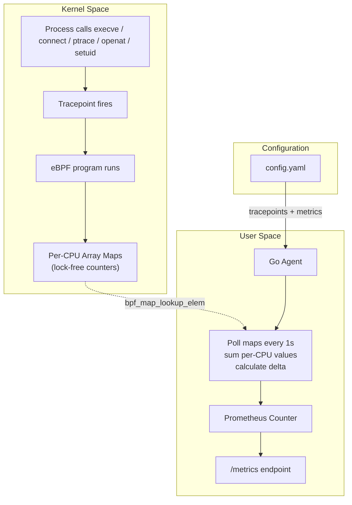
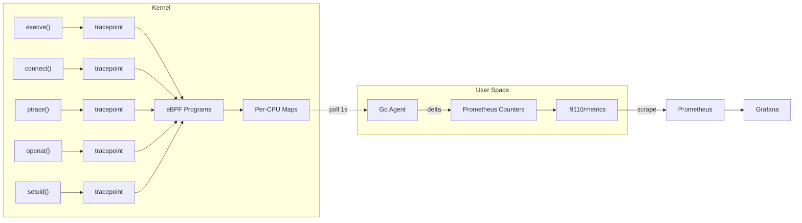

# eBPF Security Agent

A lightweight eBPF-based security monitoring agent that tracks system events in real-time.

## What It Monitors

1. **Command Executions**: All `execve` syscalls
2. **Privilege Escalation**: Sudo usage, `setuid()`, `setgid()`
3. **Sensitive File Access**: `/etc/passwd`, `/etc/shadow`, `/etc/sudoers`, `~/.ssh/authorized_keys`
4. **Network Connections**: All `connect()` calls, with C2 port flagging (4444, 1337, etc.)
5. **Process Injection**: `ptrace()` calls (debugger attach, injection attempts)

## Building

### Prerequisites

- Linux kernel 5.8+ with eBPF support
- Go 1.24+
- clang and llvm
- Kernel headers: `sudo apt install linux-headers-$(uname -r)`

### Build Steps

Using Make (recommended):
```bash
make all
```

Manual build:
```bash
# Compile eBPF program
cd bpf
clang -O2 -g -target bpf -c exec.bpf.c -o exec.bpf.o
cp exec.bpf.o ../cmd/agent/bpf/

# Build Go binary
cd ..
go build -o ebpf-agent ./cmd/agent
```

## Running

The agent requires root privileges to attach eBPF programs to kernel tracepoints:

```bash
sudo ./ebpf-agent
```

The agent will:
1. Load the eBPF programs into the kernel
2. Attach to tracepoints defined in `config.yaml`
3. Start the Prometheus metrics server on the configured port
4. Begin monitoring and logging events

## Installation as a Service

Install as a systemd service:

```bash
make install
```

Check status:
```bash
sudo systemctl status ebpf-agent
```

View logs:
```bash
sudo journalctl -u ebpf-agent -f
```

Uninstall:
```bash
make uninstall
```

## Metrics Endpoint

Metrics are exposed at `http://localhost:9110/metrics` in Prometheus format:

```bash
curl http://localhost:9110/metrics
```

Example output:
```
# HELP ebpf_exec_events_total Total execve events recorded by eBPF
# TYPE ebpf_exec_events_total counter
ebpf_exec_events_total 1234

# HELP ebpf_sudo_events_total Total sudo privilege escalation events recorded by eBPF
# TYPE ebpf_sudo_events_total counter
ebpf_sudo_events_total 5

# HELP ebpf_passwd_read_events_total Total /etc/passwd read attempts recorded by eBPF
# TYPE ebpf_passwd_read_events_total counter
ebpf_passwd_read_events_total 2
```

## How It Works



### eBPF Program (`bpf/exec.bpf.c`)

The eBPF program runs in kernel space and:
1. Attaches to the `sys_enter_execve` tracepoint
2. Reads the filename and arguments of executed commands
3. Increments counters in eBPF maps for:
   - All executions
   - Sudo commands (path ends with `/sudo`)
   - `/etc/passwd` reads (via `cat` or `sudo cat`)

The program uses **per-CPU maps** (`BPF_MAP_TYPE_PERCPU_ARRAY`) to avoid lock contention and ensure high performance even under heavy load.

### User Space Agent (`cmd/agent/main.go`)

The Go agent:
1. Loads the compiled eBPF program
2. Attaches it to the kernel tracepoint
3. Polls the eBPF maps every second
4. Aggregates per-CPU counters (sums values from all CPUs)
5. Updates Prometheus metrics with deltas
6. Serves metrics via HTTP on port 9110

### Data Flow



## Performance

The eBPF approach provides:
- **Zero overhead**: No process tracing or ptrace
- **Kernel-level visibility**: Cannot be bypassed by user-space processes
- **Efficient**: Uses per-CPU maps to avoid contention
- **Safe**: eBPF verifier ensures programs cannot crash the kernel

## Troubleshooting

### "permission denied" error
Run with sudo: `sudo ./ebpf-agent`

### "failed to load BPF program"
- Check kernel version: `uname -r` (needs 5.8+)
- Verify eBPF support: `zgrep CONFIG_BPF /proc/config.gz`
- Install kernel headers: `sudo apt install linux-headers-$(uname -r)`

### No events being logged
- Trigger some events: `ls`, `sudo ls`, `cat /etc/passwd`
- Check the logs for counter updates
- Verify the tracepoint exists: `ls /sys/kernel/debug/tracing/events/syscalls/sys_enter_execve`

### Metrics not updating
- Check if the agent is running: `ps aux | grep ebpf-agent`
- Test the metrics endpoint: `curl http://localhost:9110/metrics`
- Review agent logs for errors

## Development

### Modifying the eBPF Program

1. Edit `bpf/exec.bpf.c`
2. Recompile: `make bpf`
3. Rebuild the agent: `make build`
4. Test: `sudo ./ebpf-agent`

### Adding New Metrics

1. Add a new per-CPU map in `bpf/exec.bpf.c` (inside an `#ifdef` guard)
2. Add the detection logic in the appropriate tracepoint handler
3. Add a `MONITOR_*` flag in the `Makefile`
4. Add the metric entry in `config.yaml`
5. Rebuild: `make all`

## Security Notes

- Requires root/CAP_BPF capability
- eBPF programs are verified by the kernel for safety
- Cannot modify system behavior, only observe
- Metrics may contain sensitive information about system activity
