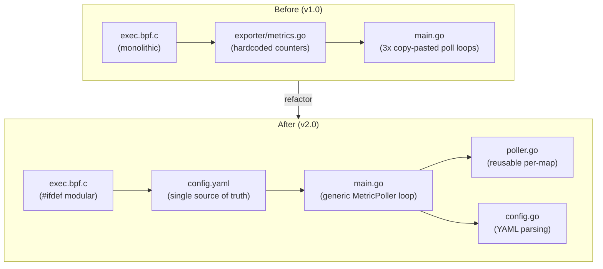

# Project State — eBPF Security Monitoring Agent

## Current State

The agent attaches to a single tracepoint (`sys_enter_execve`) and tracks three security events:

- **exec counter** — every `execve` syscall
- **sudo counter** — commands where the path ends with `/sudo`
- **passwd read counter** — `cat /etc/passwd` or `sudo cat /etc/passwd`

Metrics are exposed as Prometheus counters on `:9110/metrics`. A Docker Compose stack provides Prometheus + Grafana for collection and visualization.

No networking is traced. No file access beyond `/etc/passwd` via `cat` is monitored.

The Go agent has hardcoded polling for each map (copy-pasted three times). The eBPF C code has all detection logic inline with no modularity. Adding or changing a metric requires editing C, Go, and the exporter package.

## Planned Refactor

Goal: make the agent configurable so adjusting it for different security use cases requires minimal changes.

### Config-driven Go agent

- New `config.yaml` as single source of truth for server settings, poll interval, BPF map-to-metric mappings, and tracepoint attachments.
- Generic `MetricPoller` struct replaces the three copy-pasted polling blocks.
- Metrics registered dynamically from config — `exporter/` package gets deleted.
- CLI flags for config path and BPF object path.
- Signal handling for graceful shutdown.

### Modular eBPF C code

- Each detector (exec, sudo, passwd read) wrapped in `#ifdef` guards (`MONITOR_EXEC`, `MONITOR_SUDO`, `MONITOR_PASSWD`).
- All enabled by default.
- Adding a new detector = add a map + logic in an `#ifdef` block + a YAML entry.

### Makefile changes

- Feature flags passed to clang: `BPF_FLAGS ?= -DMONITOR_EXEC -DMONITOR_SUDO -DMONITOR_PASSWD`.
- Toggle features at compile time without editing C.

### File changes

- New: `host/ebpf-agent/config.yaml`
- New: `host/ebpf-agent/internal/config/config.go`
- New: `host/ebpf-agent/internal/poller/poller.go`
- Rewrite: `host/ebpf-agent/cmd/agent/main.go`
- Modify: `host/ebpf-agent/bpf/exec.bpf.c`
- Modify: `host/ebpf-agent/Makefile`
- Delete: `host/ebpf-agent/exporter/metrics.go`

### Not in scope yet

- Network tracing (connect, accept, bind, sendto/recvfrom)
- File access tracing beyond `/etc/passwd` (openat)
- UID/GID tracking on events
- Ring buffer for structured event streaming
- TLS/auth on the metrics endpoint
- Grafana dashboard provisioning
- Tests and CI/CD
